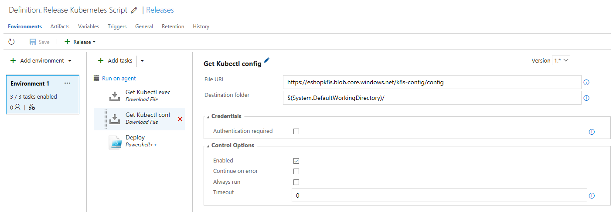
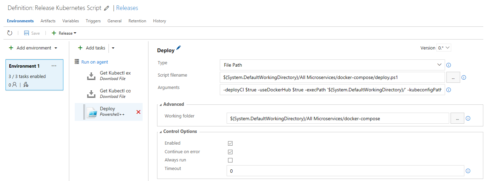

# Kubernetes CI/CD VSTS
For k8s CI/CD pipeline delivery a series of tasks must be created in VSTS to deploy k8s in Azure

## Prerequisites
* A Kubernetes cluster. Follow Azure Container Service's [walkthrough](https://docs.microsoft.com/en-us/azure/container-service/container-service-kubernetes-walkthrough) to create one. 
* A private Docker registry. Follow Azure Container Registry's [guide](https://docs.microsoft.com/en-us/azure/container-registry/container-registry-get-started-portal) to create one.
* Optionally, previous steps can be skipped if you run gen-k8s-env.ps1 script to automatically create the azure environment needed for kubernetes deployment. Azure cli 2.0 must be previously installed [installation guide](https://docs.microsoft.com/en-us/cli/azure/install-azure-cli). For example:
>```
>./gen-k8s-env -resourceGroupName k8sGroup -location westeurope -registryName k8sregistry -orchestratorName k8s-cluster -dnsName k8s-dns
>```
* An `Azure Blob storage`. It is needed for storing the kubernetes config file used by the hosted agent to access to Kubernetes cluster. Example:


* Upload the `kubernetes config file` to the blob storage previously created. Execute the following command which will download the config file into the directory `c:\Users\<User>\.kube\` and then, upload it to your blob storage: 
>```
>https://eshopk8s.blob.core.windows.net/k8s-config/config
>```
## Create the VSTS tasks
1. Create a `Download File` task to download the kubernetes binary `kubectl` to the hosted agent. For example:
>```
>https://storage.googleapis.com/kubernetes-release/release/v0.0.1.7.0-alpha.0/bin/windows/386/kubectl.exe
>```


2. Create a Download File task to download the kubernetes config file to the hosted agent. For example:
>```
>https://eshopk8s.blob.core.windows.net/k8s-config/config
>```


3. Create a powershell task to execute the k8s deployment script. For example:

* Deployment script path
>```
>$(System.DefaultWorkingDirectory)/All Microservices/docker-compose/deploy.ps1
>```

* Deployment script path arguments. Where:
     - userDockerHub: indicates if Docker Hub is used instead of ACR
     - deployCI: indicates that it is a CI/CD deployment
     - execPath: path where the k8s binary is stored
     - kubeconfigPath: path where the k8s config file is stored
>```
>-deployCI $true -useDockerHub $true -execPath '$(System.DefaultWorkingDirectory)/' -kubeconfigPath '$(System.DefaultWorkingDirectory)/'
>```


