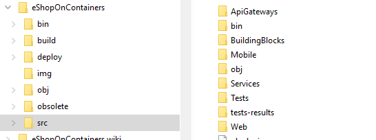
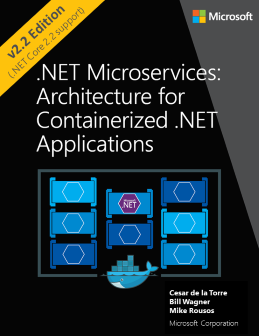
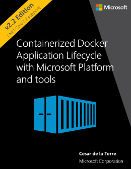

# .NET Microservices Reference Application

Sample .NET Core reference application, powered by Microsoft, based on a simplified microservices architecture and Docker containers.

## Azure DevOps - Build Status 

| Image | Status | Image | Status |
| ------------- | ------------- | ------------- | ------------- |
| Api Gateway (base) |   | Shopping Aggregator (Web) |  |
| Basket API |  | Shopping Aggregator (Mobile) |  |
| Catalog API |  | Web Client (MVC) |  |
|Identity API |  | Web Client (SPA) |  |
| Location API |  | Web Status (Health) |  |
| Marketing API |   | Webhooks API |   |
| Ordering API |  | Webhooks Client |  |
| Payment API |  | | |

_**Dev** branch contains the latest **stable** code and their images are tagged with `:dev` in our [Docker Hub](https://hub.docker.com/u/eshop)_

## Getting Started

eShopOnContainers is provided in "two flavors":

- Basic scenario: Can be run locally using docker compose, and also deployed to a local Kubernetes cluster
- Production scenario: Can only be deployed on a Kubernetes cluster (local or in the cloud like AKS), and enable production features like the use of a Service Mesh.

### Basic scenario

You can run eShop locally:

- [Using Visual Studio](https://github.com/dotnet-architecture/eShopOnContainers/wiki/Windows-setup)
- Using CLI or Visual Studio Code
- Using docker compose
- Using local Kubernetes

### Advanced scenario

The Advanced scenario can be run only in a Kubernetes cluster. Currently this scenario is the same as basic scenario with the following differences:

- Use of a Service Mesh for Resiliency

In the future more features will be implemented in the advanced scenario.

## IMPORTANT NOTES!

**You can use either the latest version of Visual Studio or simply Docker CLI and .NET CLI for Windows, Mac and Linux**.

**Note for Pull Requests (PRs)**: We accept pull request from the community. When doing it, please do it onto the **DEV branch** which is the consolidated work-in-progress branch. Do not request it onto **master** branch.

**NEWS / ANNOUNCEMENTS**
Do you want to be up-to-date on .NET Architecture guidance and reference apps like eShopOnContainers? --> Subscribe by "WATCHING" this new GitHub repo: https://github.com/dotnet-architecture/News

## Updated for .NET Core 3.0

eShopOnContainers is updated to .NET Core 3.0  "wave" of technologies. Not just compilation but also new recommended code in EF Core, ASP.NET Core, and other new related versions.

### Details on the latest mayor release

- Migrate solution from ASP.NET Core 2.2 to 3.0 and update all projects to use the latest .NET Core 3.0 templates.

- Implement the new .NET Core 3.0 WorkerService in Ordering.API and other background processes.

- Improve Ordering.API
  - Group order items
  - apply discounts from Marketing.API

- Handle two deployment scenarios
  - Basic deployment, better for learning:
    - Docker compose
    - Local Kubernetes
    - Visual Studio F5 experience

  - Advanced deployment, complex but more real-life:
    - Sidecar implementation with Envoy/Linkerd
    - Improved API Gateway and resilience
    - gRPC for inter-service communications
    - Test and Support Azure Dev Spaces

### New folder structure

The repo also has a new, simpler, folder structure, as shown in the following image:

In the above image you can see that the first folder level contains, basically:

- **build**: Scripts for building Docker images.
- **deploy**: Scripts for deployment.
- **src**: All source projects, including tests.
  - **ApiGateways**: Envoy configuration and Aggregators source code.
  - **BuildBlocks**: Common components used by several projects.
  - **Mobile**: Mobile apps projects.
  - **Services**: Backend for all services. Including unit and functional tests for some projects.
    - Basket
    - Catalog
    - Identity
    - Location
    - Marketing
    - Ordering
    - Payment
    - Webhooks
  - **Tests**: General functional application tests.
  - **test-results**: Test results
  - **Web**: Web applications

>**PLEASE** Read our [branch guide](./branch-guide.md) to know about our branching policy
>
> ### DISCLAIMER
>
> **IMPORTANT:** The current state of this sample application is **BETA**, because we are constantly evolving towards newly released technologies. Therefore, many areas could be improved and change significantly while refactoring the current code and implementing new features. Feedback with improvements and pull requests from the community will be highly appreciated and accepted.
>
> Read the planned [Roadmap](https://github.com/dotnet-architecture/eShopOnContainers/wiki/Roadmap) within the Wiki for further info about possible new implementations and provide feedback at the [ISSUES section](https://github.com/dotnet/eShopOnContainers/issues) if you'd like to see any specific scenario implemented or improved. Also, feel free to discuss on any current issue.

### Architecture overview

This reference application is cross-platform at the server and client side, thanks to .NET Core services capable of running on Linux or Windows containers depending on your Docker host, and to Xamarin for mobile apps running on Android, iOS or Windows/UWP plus any browser for the client web apps.
The architecture proposes a microservice oriented architecture implementation with multiple autonomous microservices (each one owning its own data/db) and implementing different approaches within each microservice (simple CRUD vs. DDD/CQRS patterns) using Http as the communication protocol between the client apps and the microservices and supports asynchronous communication for data updates propagation across multiple services based on Integration Events and an Event Bus (a light message broker, to choose between RabbitMQ or Azure Service Bus, underneath) plus other features defined at the [roadmap](https://github.com/dotnet-architecture/eShopOnContainers/wiki/Roadmap).

## Related documentation and guidance

You can find the related reference **Guide/eBook** focusing on **architecting and developing containerized and microservice based .NET Applications** (download link available below) which explains in detail how to develop this kind of architectural style (microservices, Docker containers, Domain-Driven Design for certain microservices) plus other simpler architectural styles, like monolithic apps that can also live as Docker containers.

There are also additional eBooks focusing on Containers/Docker lifecycle (DevOps, CI/CD, etc.) with Microsoft Tools, already published plus an additional eBook focusing on Enterprise Apps Patterns with Xamarin.Forms.
You can download them and start reviewing these Guides/eBooks here:

| Architecting & Developing | Containers Lifecycle & CI/CD | App patterns with Xamarin.Forms |
| ------------ | ------------|  ------------|
|  |  |  |
|  <a href='https://aka.ms/microservicesebook'>**Download .PDF**</a>   |  <a href='https://aka.ms/dockerlifecycleebook'>**Download** </a>   |  <a href='https://aka.ms/xamarinpatternsebook'>**Download**  </a>   |

Download in other formats (**eReaders** like **MOBI**, **EPUB**) and other eBooks at the [.NET Architecture center](http://dot.net/architecture).

Send feedback to [dotnet-architecture-ebooks-feedback@service.microsoft.com](dotnet-architecture-ebooks-feedback@service.microsoft.com)

However, we encourage you to download and review the [Architecting and Developing Microservices eBook](https://aka.ms/microservicesebook) because the architectural styles and architectural patterns and technologies explained in the guide are using this reference application when explaining many pattern implementations, so you'll understand the context, design and decisions taken in the current architecture and internal designs much better.

## Overview of the application code

In this repo you can find a sample reference application that will help you to understand how to implement a microservice architecture based application using **.NET Core** and **Docker**.

The example business domain or scenario is based on an eShop or eCommerce which is implemented as a multi-container application. Each container is a microservice deployment (like the basket-microservice, catalog-microservice, ordering-microservice and the identity-microservice) which is developed using ASP.NET Core running on .NET Core so they can run either on Linux Containers and Windows Containers.
The screenshot below shows the VS Solution structure for those microservices/containers and client apps.

- (*Recommended when getting started*) Open **eShopOnContainers-ServicesAndWebApps.sln** for a solution containing just the server-side projects related to the microservices and web applications.
- Open <b>eShopOnContainers-MobileApps.sln</b> for a solution containing just the client mobile app projects (Xamarin mobile apps only). It works independently based on mocks, too.
- Open <b>eShopOnContainers.sln</b> for a solution containing all the projects (All client apps and services).

Finally, those microservices are consumed by multiple client web and mobile apps, as described below.
 
<b>*MVC Application (ASP.NET Core)*</b>: It's an MVC application where you can find interesting scenarios on how to consume HTTP-based microservices from C# running in the server side, as it is a typical ASP.NET Core MVC application. Since it is a server-side application, access to other containers/microservices is done within the internal Docker Host network with its internal name resolution.

 
<b>*SPA (Single Page Application)*</b>: Providing similar "eShop business functionality" but developed with Angular, Typescript and slightly using ASP.NET Core MVC. This is another approach for client web applications to be used when you want to have a more modern client behavior which is not behaving with the typical browser round-trip on every action but behaving like a Single-Page-Application which is more similar to a desktop app usage experience. The consumption of the HTTP-based microservices is done from TypeScript/JavaScript in the client browser, so the client calls to the microservices come from out of the Docker Host internal network (Like from your network or even from the Internet).

 
<b>*Xamarin Mobile App (For iOS, Android and Windows/UWP)*</b>: It is a client mobile app supporting the most common mobile OS platforms (iOS, Android and Windows/UWP). In this case, the consumption of the microservices is done from C# but running on the client devices, so out of the Docker Host internal network (Like from your network or even the Internet).

## Sending feedback and pull requests

As mentioned, we'd appreciate your feedback, improvements and ideas.
You can create new issues at the issues section, do pull requests and/or send emails to **eshop_feedback@service.microsoft.com**
