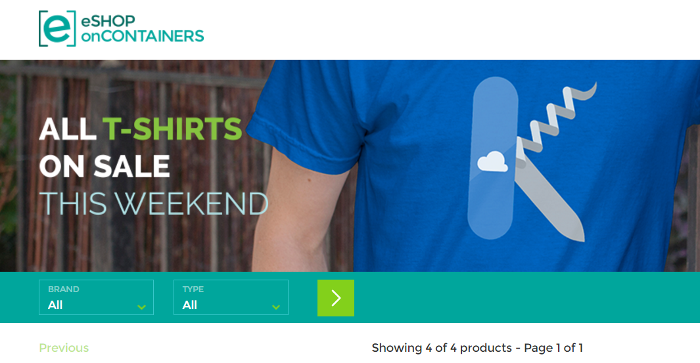

# Containerized eShop
Sample reference containerized application, cross-platform and microservices architecture. 
Powered by Microsoft

#Overview
In this repo you will fin samples that will help you to get introduced into <b>.net core</b>, microservices environment and <b>docker</b>.

#Tools
#### Windows
<a href='https://github.com/docker/toolbox/releases/download/v1.12.3/DockerToolbox-1.12.3.exe'>Docker tools for windows</a>

####Mac
<a href='https://github.com/docker/toolbox/releases/download/v1.12.3/DockerToolbox-1.12.3.pkg'>Docker tools for Mac</a>

##Set up Cpu and Memory
In this demo we will run 3 instances of SQL Server, 6 asp.net core applications and 1 redis server it's important to set up properly the Cpu and Ram assigned to docker. This can be set, once installed docker in your device through the whale icon, right click, settings and in the Advanced option you will need to adjust the default to the new values shown in the image: 

#Demo
The demo scenario is based on a ecommerce shop, each service is a .net core web application (basket, catalog, ordering, identity) and this services are consumed by differents web and mobile applications.

MVC Application: Its an Mvc 6 development where you can find good samples about how to work with microservices in a MVC asp.net core application. 

SPA Application: Developed with Angular2, Typescript and Mvc 6, is another different aproach in web on how to work in a Microservices oriented solution.

Xamarin Application (Ios, Windows, Android): Its a client application that run in mobile devices (ios, android, windows) and you can find another example on how to build a microservices oriented application. 

#Deploy goblal
In the global directory you will find the scripts needed to run and deploy the demo into your local docker infraestructure. The steps: 

- <a href='build-images.ps1'>build-images.ps1</a>  <b>Build .net applications and docker images</b>: This power shell script that you will find in the <u>root directory of the solution</u> is the responsible of building .net applications and package in a pub folder and use docker commands to build the images needed to run the previously packaged .net applications. 

- <b>Compose containers in your docker local VM</b>: Finally you have to open your favourite command tool <u>pointing to the root directory of the solution</u> where docker-compose.yml file is located and run the command  `docker-compose up`

#Run
Once the deploy process of docker-compose finishes you have to be able to access the services in this urls from your machine:
- Web: http://localhost:5100
- Web Spa: http://localhost:5104
- Catalog service: http://localhost:5101
- Orders service: http://localhost:5102
- Basket service: http://localhost:5103
- Identity service: http://localhost:5105
- Orders data (SQL Server): Server=tcp:localhost,5432;Database=Microsoft.eShopOnContainers.Services.OrderingDb;User Id=sa;Password=Pass@word;
- Catalog data (SQL Server): Server=tcp:localhost,5434;Database=CatalogDB;User Id=sa;Password=Pass@word
- Identity data (SQL Server): Server=localhost,5433;Database=aspnet-Microsoft.eShopOnContainers;User Id=sa;Password=Pass@word
- Basket data (Redis): listening in localhost:6379

#Deploy individiual services into docker
Under each project root you will find a readme.md file as this that describes how to run and deploy the service individually into a docker container.

