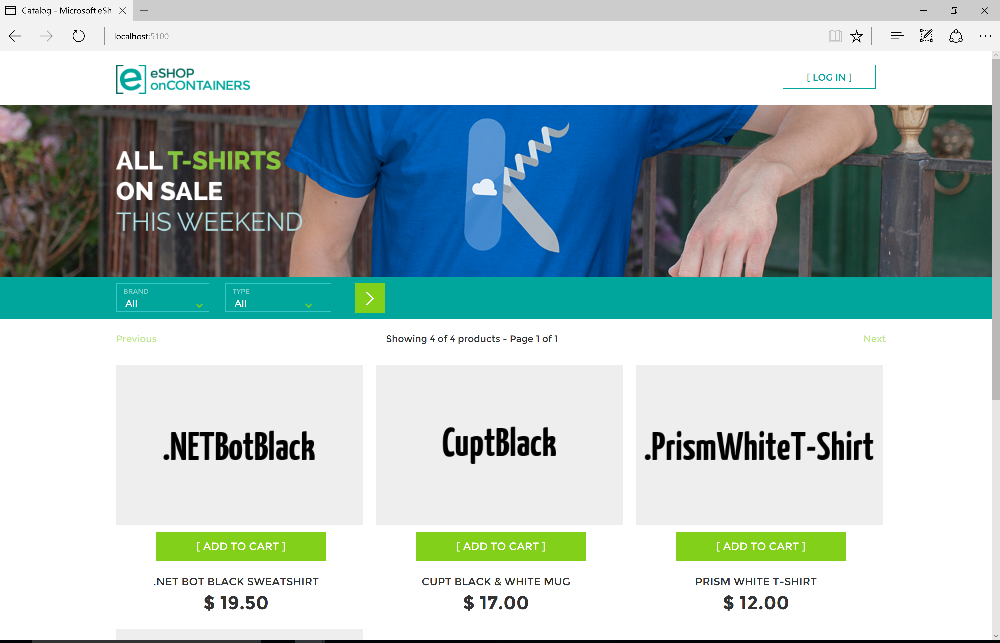
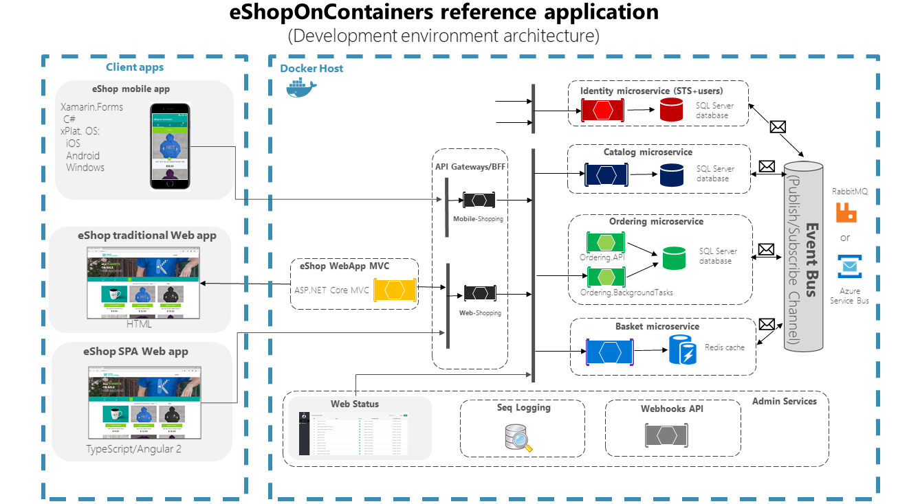
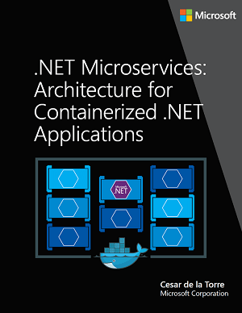
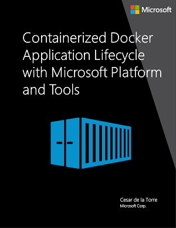
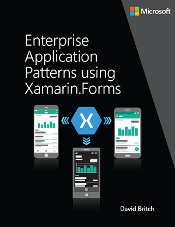

# .NET Microservices Sample Reference Application

Sample .NET Core reference application, powered by Microsoft, based on a simplified microservices architecture and Docker containers.

## Azure DevOps - Build Status

| Image | Status | Image | Status |
| ------------- | ------------- | ------------- | ------------- |
| Api Gateway (base) |   | Shopping Aggregator (Web) |  |
| Basket API |  | Shopping Aggregator (Mobile) |  |
| Catalog API |  | Web Client (MVC) |  |
|Identity API |  | Web Client (SPA) |  |
| Location API |  | Web Status (Health) |  |
| Marketing API |   | Webhooks API |   |
| Ordering API |  | Webhooks Client |  |
| Payment API |  | | |

_**Dev** branch contains the latest **beta** code and their images are tagged with `:linux-dev` in our [Docker Hub](https://hub.docker.com/u/eshop)_

## Are you new to **microservices** and **cloud-native development**? 
Take a look at the free course [Create and deploy a cloud-native ASP.NET Core microservice](https://docs.microsoft.com/en-us/learn/modules/microservices-aspnet-core/) on MS Learn.  This module explains microservices concepts, cloud-native technologies, and reduce the friction in getting started with `eShopOnContainers`.

## Getting Started

*eShopOnContainers* is provided in two flavors: Basic and Advanced.

### Basic scenario

The basic scenario can be run locally using docker-compose, and also deployed to a local Kubernetes cluster. Refer to these Wiki pages to Get Started:

- [CLI or Visual Studio Code](https://github.com/dotnet-architecture/eShopOnContainers/wiki/Windows-setup)
- [Visual Studio (F5 experience)](https://github.com/dotnet-architecture/eShopOnContainers/wiki/Windows-setup#optional---use-visual-studio)
- [Docker compose](https://github.com/dotnet-architecture/eShopOnContainers/wiki/Docker-compose-deployment-files)
- [Local Kubernetes](https://github.com/dotnet-architecture/eShopOnContainers/wiki/Deploy-to-Local-Kubernetes)

### Advanced scenario

The Advanced scenario can be run only in a Kubernetes cluster. Currently this scenario is the same as basic scenario with the following differences:

- [Deploy to AKS with a Service Mesh for resiliency](https://github.com/dotnet-architecture/eShopOnContainers/wiki/Deploy-to-Azure-Kubernetes-Service-(AKS))

In the future more features will be implemented in the advanced scenario.

## IMPORTANT NOTES!

**You can use either the latest version of Visual Studio or simply Docker CLI and .NET CLI for Windows, Mac and Linux**.

**Note for Pull Requests (PRs)**: We accept pull request from the community. When doing it, please do it onto the **DEV branch** which is the consolidated work-in-progress branch. Do not request it onto **master** branch.

**NEWS / ANNOUNCEMENTS**
Do you want to be up-to-date on .NET Architecture guidance and reference apps like eShopOnContainers? --> Subscribe by "WATCHING" this new GitHub repo: https://github.com/dotnet-architecture/News

## Updated for .NET Core 3.1 (LTS)

eShopOnContainers is updated to .NET Core 3.1  "wave" of technologies. Not just compilation but also new recommended code in EF Core, ASP.NET Core, and other new related versions with several significant changes.

**See more details in the [Release notes](https://github.com/dotnet-architecture/eShopOnContainers/wiki/Release-notes) wiki page**.

>**PLEASE** Read our [branch guide](./branch-guide.md) to know about our branching policy
>
> ### DISCLAIMER
>
> **IMPORTANT:** The current state of this sample application is **BETA**, because we are constantly evolving towards newly released technologies. Therefore, many areas could be improved and change significantly while refactoring the current code and implementing new features. Feedback with improvements and pull requests from the community will be highly appreciated and accepted.

### Architecture overview

This reference application is cross-platform at the server and client side, thanks to .NET Core services capable of running on Linux or Windows containers depending on your Docker host, and to Xamarin for mobile apps running on Android, iOS or Windows/UWP plus any browser for the client web apps.
The architecture proposes a microservice oriented architecture implementation with multiple autonomous microservices (each one owning its own data/db) and implementing different approaches within each microservice (simple CRUD vs. DDD/CQRS patterns) using Http as the communication protocol between the client apps and the microservices and supports asynchronous communication for data updates propagation across multiple services based on Integration Events and an Event Bus (a light message broker, to choose between RabbitMQ or Azure Service Bus, underneath) plus other features defined at the [roadmap](https://github.com/dotnet-architecture/eShopOnContainers/wiki/Roadmap).

## Related documentation and guidance

You can find the related reference **Guide/eBook** focusing on **architecting and developing containerized and microservice based .NET Applications** (download link available below) which explains in detail how to develop this kind of architectural style (microservices, Docker containers, Domain-Driven Design for certain microservices) plus other simpler architectural styles, like monolithic apps that can also live as Docker containers.

There are also additional eBooks focusing on Containers/Docker lifecycle (DevOps, CI/CD, etc.) with Microsoft Tools, already published plus an additional eBook focusing on Enterprise Apps Patterns with Xamarin.Forms.
You can download them and start reviewing these Guides/eBooks here:

| Architecting & Developing | Containers Lifecycle & CI/CD | App patterns with Xamarin.Forms |
| ------------ | ------------|  ------------|
|  |  |  |
|  <a href='https://aka.ms/microservicesebook'>**Download PDF**</a>   |  <a href='https://aka.ms/dockerlifecycleebook'>**Download PDF** </a>   |  <a href='https://aka.ms/xamarinpatternsebook'>**Download PDF**  </a>   |

For more free e-Books check out [.NET Architecture center](https://dot.net/architecture). If you have an e-book feedback, let us know by creating a new issue here: <https://github.com/dotnet-architecture/ebooks/issues>

## Read further

- [Explore the application](https://github.com/dotnet-architecture/eShopOnContainers/wiki/Explore-the-application)
- [Explore the code](https://github.com/dotnet-architecture/eShopOnContainers/wiki/Explore-the-code)

## Sending feedback and pull requests

Read the planned [Roadmap](https://github.com/dotnet-architecture/eShopOnContainers/wiki/Roadmap) within the Wiki for further info about possible new implementations and provide feedback at the [ISSUES section](https://github.com/dotnet/eShopOnContainers/issues) if you'd like to see any specific scenario implemented or improved. Also, feel free to discuss on any current issue.
