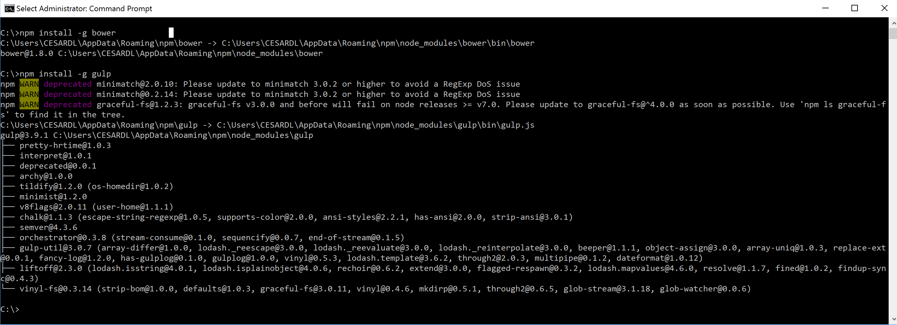
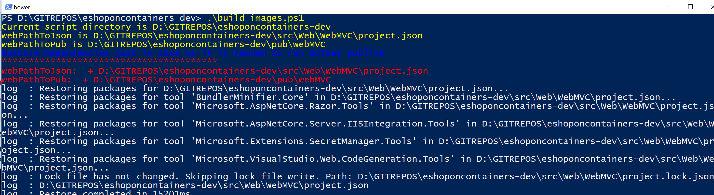
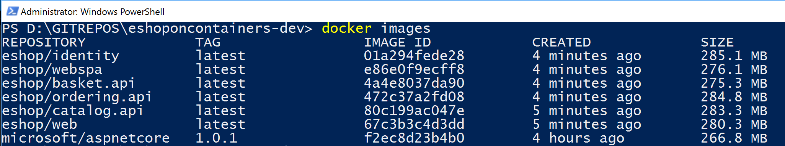
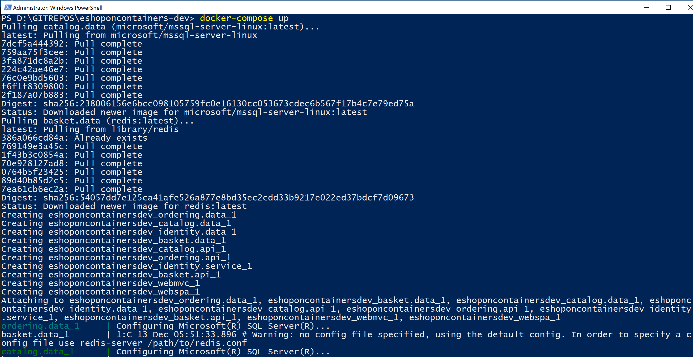
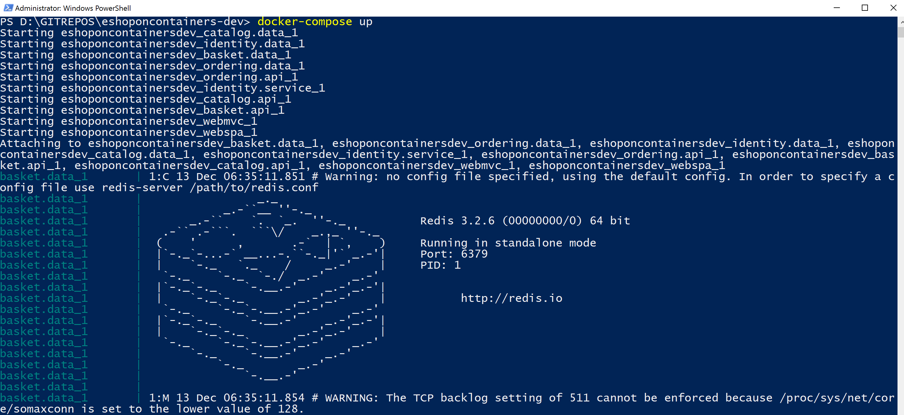
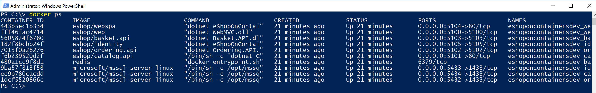
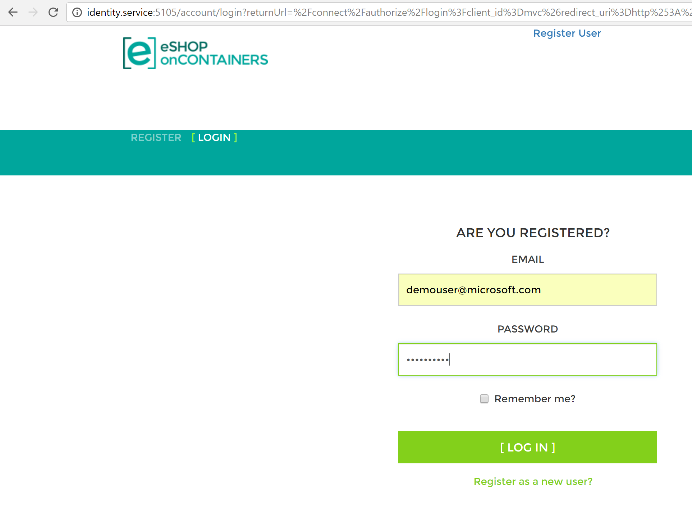
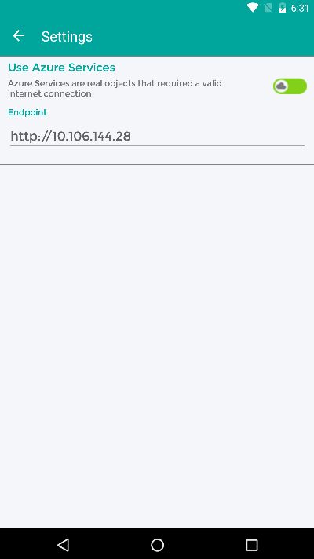

# eShopOnContainers - Microservices Architecture and Containers based Reference Application (**ALPHA state**)
Sample .NET Core reference application, powered by Microsoft, based on a simplified microservices architecture and Docker containers. It is cross-platform thanks to .NET Core services capable of running on Linux or Windows containers depending on your Docker host. 

<b>IMPORTANT NOTE</b>: In this solution, the SQL databases are automatically deployed with sample data into a single SQL Server for Linux container (a single shared Docker container for SQL databases) so the whole solution can be up and running without any dependency in the cloud or server. A similar case is defined in regards Redis cache running as a container. However, in a real production environment it is recommended to have persistance (SQL Server and Redis) in HA services like Azure SQL Database, Redis as a service or any other clustering system. If you want to configure this solution like that, you'll just need to change the connection strings once you have set up the servers in the cloud or on-premises.

## Overview
In this repo you can find a sample reference application that will help you to understand how to implement a microservice architecture based application using <b>.NET Core</b> and <b>Docker</b>.

The example business domain or scenario is based on an eShop or eCommerce which is implemented as a multi-container application. Each container is a microservice deployment (like the basket-microservice, catalog-microservice, ordering-microservice and the  identity-microservice) which are developed using ASP.NET Core running on .NET Core so they can run either on Linux Containers and Windows Containers.
The screenshot below shows the VS Solution structure for those microservices/containers and client apps.
- Open <b>eShopOnContainers.sln</b> for a solution containing all the projects (All client apps and services).
- Open <b>eShopOnContainers-ServicesAndWebApps.sln</b> for a solution containing just the server-side projects related to the microservices and web applications.
- Open <b>eShopOnContainers-MobileApps.sln</b> for a solution containing just the client mobile app projects (Xamarin mobile apps only).

Finally, those microservices are consumed by multiple client web and mobile apps, as described below.

<b>*MVC Application (ASP.NET Core)*</b>: Its an MVC 6 application where you can find interesting scenarios on how to consume HTTP-based microservices from C# running in the server side, as it is a typical ASP.NET Core MVC application. Since it is a server-side application, access to other containers/microservices is done within the internal Docker Host network with its internal name resolution.

<b>*SPA (Single Page Application)*</b>: Developed with Angular 2, Typescript and ASP.NET Core MVC 6. This is another approach for client web applications to be used when you want to have a more modern behavior which is not behaving with the typical browser round-trip on every action but behaving like a Single-Page-Application which is more similar to a desktop app experience. The consumption of the HTTP-based microservices is done from TypeScript/JavaScript in the client browser, so out of the Docker Host internal network (Like from your network or even from the Internet). 
-  <<<<< TBD Image for SPA App >>>>>

<b>*Xamarin Mobile App (For iOS, Android and Windows/UWP)*</b>: It is a client mobile app supporting the most common mobilee OS platforms (iOS, Android and Windows/UWP). In this case, the consumption of the microservices is done from C# but running on the client devices, so out of the Docker Host internal network (Like from your network or even the Internet).

> ### Note on tested Docker Containers/Images
> The development and testing of this project was (as of January 2017) done <b>only on Docker Linux containers</b> running in development machines with "Docker for Windows" and the default Hyper-V Linux VM (MobiLinuxVM) installed by "Docker for Windows". 
The <b>Windows Containers scenario has not been implemented/tested yet</b>, but the application should be able to run on Windows Containers based on different Docker base images, as well, as the .NET Core services have also been tested running on plain Windows (with no Docker).
The app was also partially tested on "Docker for Mac" using a development MacOS machine with .NET Core and VS Code installed. However, that is still a scenario using Linux containers running on the VM setup in the Mac by the "Docker for Windows" setup.
 

## Development Environment Setup
### Requirements for January 2016 version of eShopOnContainers

WINDOWS DEV MACHINE
- Visual Studio 2015 with latest Update
- .NET Core 1.0 (Including ASP.NET Core and VS Tooling)
- Bower and Gulp as global installs (See steps below)
- <a href='https://docs.docker.com/docker-for-windows/'>Docker for Windows</a>

MAC DEV MACHINE
- Visual Studio Code
- .NET Core 1.0 for Mac
- Bower and Gulp as global installs (See steps below)
- <a href='https://docs.docker.com/docker-for-mac/'>Docker for Mac</a>

### Installing and configuring Docker in your development machine

#### Set needed assigned Memory and CPU to Docker
In this application (January 2017 version) we run 1 instance of SQL Server running as a container with multiple databases (one DB per microservice), plus 6 ASP.NET Core apps/services and 1 Redis server, all of them running as Docker containers. So, especially because of SQL Server requirements on memory, it is important to set Docker up properly with enough memory RAM and CPU assigned to it or you will get difficult errors when starting the containers with "docker-compose up". 
Once Docker for Windows/Mac is installed in your machine, enter into its Settings and the Advanced menu option so you are able to adjust it to the minimum amount of memory and CPU (Memory: Around 4096MB and CPU:3) as shown in the image. Usually you might need a 16GB memory machine for this configuration if you also want to run the Android emulator for the Xamarin app at the same time. If you have a less powerful machine, you can try with a lower configuration and/or by not starting certain containers like the basket and Redis. But if you don't start all the containers, the application will not fully function properly, of course. 

#### Bower and Gulp global installation
Before generating the Docker images, and specifically when generating the web apps binaries with "dotnet publish" from the custom scripts (like when running the build-images.ps1 script from PowerShell or the build-images.sh from bash in a Mac), it needs to have access to the paths where you have installed Bower and Gulp. For that, the recommendation is to install Bower and Gulp with a global installation by running the following commands from command-line or bash:

`npm install -g bower` 

`npm install -g gulp`

Below you can see how those commands are run in Windows:

## Build, Ship, Run 
In the global directory you will find the scripts needed to build, deploy and run the application into your local Docker development machine. The steps are the following: 

### Compile the .NET apps and Build the Docker images
- Open a PowerShell window in Windows, move to the root folder of your solution and run the <b>build-images.ps1</b> script file like in the following screenshot.

<b>IMPORTANT</b>: This script deletes all the Docker images registered in your local dev machine repository before creating the new images, so it is starting from a 100% clean state. If you don't want your local images in your PC to be deleted, edit and change the <b>build-images.ps1</b> script file before you run it.

- This Power-Shell script that you will find in the <u>root directory of the solution</u> is responsible for building the .NET applications, copy the binaries in a pub folder and use Docker CLI commands to build the custom Docker images needed to run the containers. You can see how to run that PowerShell script in the screenshot below:

- Once it finishes, you can check it out with Docker CLI if the images were generated correctly by typing in the PowerShell console the command: `docker images`

Those Docker images are the ones you have available in your local image repository in your machine.
You might have additional images, but at least, you should see the following list of images which are 6 custom images starting with the prefix "eshop" which is the name of the image repo. The rest of the images that are not starting with "eshop" will probably be official base-images like the microsoft/aspnetcore or the SQL Server for Linux images.

### Deploy containers into your Docker host
You can deploy Docker containers to a regularDocker host either by using the `docker run` command which need to be executed once per microservice, or by using the CLI tool `docker-compose up` which is very convenient for multi-container applications as it can spin-up all the multiple containers in your application with a single command. These are the steps:
- <b>Run your containers in your local host</b>: Open your favorite command tool (PowerShell od CommandLine in Windows / Bash in Mac) <u> and move to the root directory of the solution</u> where the docker-compose.yml file is located and run the command `docker-compose up`. When running "docker-compose up" you should see something similar to the following screenshot in the PowerShell command window, although it will much longer than that, also showing many internal SQL commands from the services when populating the first time the sample data.
`docker-compose up`

- Note that the first time you run any container (with docker run or docker-compose) it detects that it needs the base images we are using, like the SQL Server image and the Redis image, so it will pull or download those base images from the Internet, from the public repo at the Docker registry named DOCKER HUB, by pulling the "microsoft/mssql-server-linux" which is the base image for the SQL Server for Linux on containers, and the "library/redis" which is the base Redis image. Therefore, the first time you run docker-compose it might take a few minutes pulling those images before it spins up your custom containers.
The next time you run docker-compose up, since it'll have those base images already pulled/downloaded, it will just start the containers, like in the following screenshot:

- <b>Check out the containers running in your Docker host</b>: Once docker-compose up finishes after a few minutes, you will have that PowerShell showing the execution's output in a "wait state", so in order to ask to Docker about "how it went" and see what containers are running, you need to open a second PowerShell window and type "docker ps" so you'll see all the running containers, as shown in the following screenshot.
 
You can see the 6 custom containers running the microservices plus the 2 web applications. In adition you have the containers with the SQL databases and the Redis cache for the basket microservice data.

#### IMPORTANT: Open ports in Firewall so Authentication to the STS (Security Token Service container) can be done through the 10.0.75.1 IP which should be available and already setup by Docker
- You can manually create a rule in your local firewall in your development machine or you can also create that rule by just executing the <b>add-firewall-docker.ps1</b> script in the solution's root. 
- Basically, you need to open the ports 5100 to 5105 that are used by the solution.

### Test the applications and microservices
Once the deploy process of docker-compose finishes you should be able to access the services in the following URLs or connection string, from your dev machine:

- Web MVC: <a href="http://localhost:5100" target="top">http://localhost:5100</a>
- Web Spa: <a href="http://localhost:5104" target="top">http://localhost:5104</a> (Important, check how to set up the SPA app and requirements before building the Docker images. Instructions at  https://github.com/dotnet/eShopOnContainers/tree/master/src/Web/WebSPA/eShopOnContainers.WebSPA or the README.MD from eShopOnContainers/src/Web/WebSPA/eShopOnContainers.WebSPA)
- Catalog microservice: <a href="http://localhost:5101" target="top">http://localhost:5101</a> (Not secured)
- Ordering microservice: <a href="http://localhost:5102" target="top">http://localhost:5102</a> (Requires token for authorization)
- Basket microservice: <a href="http://localhost:5103" target="top">http://localhost:5103</a> (Requires token for authorization)
- Identity microservice: <a href="http://localhost:5105" target="top">http://localhost:5105</a>
- Orders database (SQL Server connection string): Server=tcp:localhost,5432;Database=Microsoft.eShopOnContainers.Services.OrderingDb;User Id=sa;Password=Pass@word;
- Catalog database (SQL Server connection string): Server=tcp:localhost,5434;Database=CatalogDB;User Id=sa;Password=Pass@word
- ASP.NET Identity database (SQL Server connection string): Server=localhost,5433;Database=aspnet-Microsoft.eShopOnContainers;User Id=sa;Password=Pass@word
- Basket data (Redis): listening at localhost:6379
 
#### Trying the Web MVC application with the DemoUser@microsoft.com user account
When you try the Web MVC application by using the url http://localhost:5100, you'll be able to test the home page which is also the catalog page. But when trying to add any article to the basket you will get redirected to the login page which is handled by the STS microservice (Security Token Service). At this point, you could register your own user/customer or you can also use a convenient default user/customer named DemoUser@microsoft.com so you don't need to register your own user and it'll be easier to test.
The credentials for this demo user are:
- User: demouser@microsoft.com
- Password: Pass@word1

Below you can see the login page when providing those credentials.

#### Trying the Xamarin.Forms mobile apps for Android, iOS and Windows
By default, this app shows fake data from mock-services. In order to really access the microservices/containers in Docker from the mobile app, you need to:
 - Disable mock-services in the Xamarin app by setting the <b>UseMockServices = false</b> in the App.xaml.cs and specify the host IP in  BaseEndpoint = "http://10.106.144.28" at the GlobalSettings.cs. Both files in the Xamarin.Forms project (PCL).
 - Another alternative is to change that IP through the app UI, by modifying the IP address in the Settings page of the App as shown in the screenshot below. 
- In addition, you need to make sure that the used TCP ports of the services are open in the local firewall. 

### Deploying individiual services into Docker
Under each project root you will find a readme.md file which describes how to run and deploy the service individually into a docker host.

> ### Note on Windows Containers
> As mentioned, the development and testing of this project (January 2017 version) was done on Docker Linux containers running in development machines with "Docker for Windows" and the default Hyper-V Linux VM (MobiLinuxVM) installed by "Docker for Windows". 
In order to run the application on Windows Containers you'd need to change the base images used by each container:
> - Official .NET Core base-image for Windows Containers, at Docker Hub: https://hub.docker.com/r/microsoft/dotnet/ (Using the Windows Nanoserver tag)
> - Official base-image for SQL Server on Windows Containers, at Docker Hub: https://hub.docker.com/r/microsoft/mssql-server-windows

