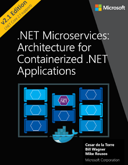

# eShopOnContainers - Microservices Architecture and Containers based Reference Application (**BETA state** - Visual Studio 2017 and CLI environments compatible)
Sample .NET Core reference application, powered by Microsoft, based on a simplified microservices architecture and Docker containers. <p>
**Note for Pull Requests**: We accept pull request from the community. When doing it, please do it onto the DEV branch which is the consolidated work-in-progress branch. Do not request it onto Master, if possible.

> ### DISCLAIMER
> **IMPORTANT:** The current state of this sample application is **BETA**, consider it version a 0.1 foundational version, therefore, many areas could be improved and change significantly while refactoring current code and implementing new features. **Feedback with improvements and pull requests from the community will be highly appreciated and accepted.**
>
> This reference application proposes a simplified microservice oriented architecture implementation to introduce technologies like .NET Core with Docker containers through a comprehensive application. The chosen domain is an eShop/eCommerce but simply because it is a well-know domain by most people/developers.
However, this sample application should not be considered as an "eCommerce reference model", at all. The implemented business domain might not be ideal from an eCommerce business point of view. It is neither trying to solve all the problems in a large, scalable and mission-critical distributed system. It is just a bootstrap for developers to easily get started in the world of Docker containers and microservices with .NET Core.
> <p>For example, the next step (still not covered in eShopOnContainers) after understanding Docker containers and microservices development with .NET Core, is to select a microservice cluster/orchestrator like Docker Swarm, Kubernetes or DC/OS (in Azure Container Service) or Azure Service Fabric which in most of the cases will require additional partial changes to your application's configuration (although the present architecture should work on most orchestrators with small changes).
> Additional steps would be to move your databases to HA cloud services, or to implement your EventBus with Azure Service Bus or any other production ready Service Bus in the market.
> <p> In the future we might fork this project and make multiple versions targeting specific microservice cluster/orchestrators plus using additional cloud infrastructure. <p>
> 
> Read the planned <a href='https://github.com/dotnet/eShopOnContainers/wiki/01.-Roadmap-and-Milestones-for-future-releases'>Roadmap and Milestones for future releases of eShopOnContainers</a> within the Wiki for further info about possible new implementations and provide feedback at the  <a href='https://github.com/dotnet/eShopOnContainers/issues'>ISSUES section</a> if you'd like to see any specific scenario implemented or improved. Also, feel free to discuss on any current issue.

**Architecture overview**: This reference application is cross-platform either at the server and client side, thanks to .NET Core services capable of running on Linux or Windows containers depending on your Docker host, and to Xamarin for mobile apps running on Android, iOS or Windows/UWP plus any browser for the client web apps.
The architecture proposes a simplified microservice oriented architecture implementation with multiple autonomous microservices (each one owning its own data/db) and implementing different approaches within each microservice (simple CRUD vs. DDD/CQRS patterns) using Http as the current communication protocol.
<p>
It also supports asynchronous communication for data updates propagation across multiple services based on Integration Events and an Event Bus plus other features defined at the <a href='https://github.com/dotnet/eShopOnContainers/wiki/01.-Roadmap-and-Milestones-for-future-releases'>roadmap</a>.
<p>


<p>
The microservices are different in type, meaning different internal architecture patterns approaches depending on it purpose, as shown in the image below.
<p>

<p>
<p>
Additional miroservice styles with other frameworks and No-SQL databases will be added, eventually. This is a great opportunity for pull requests from the community, like a new microservice using Nancy, or even other languages like Node, Go, Python or data containers with MongoDB with Azure DocDB compatibility, PostgreSQL, RavenDB, Event Store, MySql, etc. You name it! :)

> ### Important Note on Database Servers/Containers
> In this solution's current configuration for a development environment, the SQL databases are automatically deployed with sample data into a single SQL Server for Linux container (a single shared Docker container for SQL databases) so the whole solution can be up and running without any dependency to any cloud or specific server. Each database could also be deployed as a single Docker container, but then you'd need more then 8GB or memory RAM assigned to Docker in your development machine in order to be able to run 3 SQL Server Docker containers in your Docker Linux host in "Docker for Windows" or "Docker for Mac" development environments.
> <p> A similar case is defined in regards Redis cache running as a container for the development environment.
> <p> However, in a real production environment it is recommended to have your databases (SQL Server and Redis, in this case) in HA (High Available) services like Azure SQL Database, Redis as a service or any other clustering system. If you want to change to a production configuration, you'll just need to change the connection strings once you have set up the servers in a HA cloud or on-premises.

## Related documentation and guidance
While developing this reference application, we've been creating a reference <b>Guide/eBook</b> focusing on <b>architecting and developing containerized and microservice based .NET Applications</b> (download link available below) which explains in detail how to develop this kind of architectural style (microservices, Docker containers, Domain-Driven Design for certain microservices) plus other simpler architectural styles, like monolithic apps that can also live as Docker containers.
<p>
There are also additional eBooks focusing on Containers/Docker lifecycle (DevOps, CI/CD, etc.) with Microsoft Tools, already published plus an additional eBook focusing on Enterprise Apps Patterns with Xamarin.Forms.
You can download them and start reviewing these Guides/eBooks here:
<p>

| Architecting & Developing | Containers Lifecycle & CI/CD | App patterns with Xamarin.Forms |
| ------------ | ------------|  ------------|
| <a href='https://aka.ms/microservicesebook'> </a> | <a href='https://aka.ms/dockerlifecycleebook'>  </a> | <a href='https://aka.ms/xamarinpatternsebook'>  </a> |
| <sup> <a href='https://aka.ms/microservicesebook'>**Download** (First Edition)</a> </sup>  | <sup> <a href='https://aka.ms/dockerlifecycleebook'>**Download** (First Edition from late 2016) </a>  </sup> | <sup> <a href='https://aka.ms/xamarinpatternsebook'>**Download** (First Edition) </a>  </sup> |

Send feedback to [dotnet-architecture-ebooks-feedback@service.microsoft.com](dotnet-architecture-ebooks-feedback@service.microsoft.com)
<p>
However, we encourage to download and review the "Architecting & Developing eBook" because the architectural styles and architectural patterns and technologies explained in the guidance are using this reference application when explaining many pattern implementations, so you'll understand much better the context, design and decisions taken in the current architecture and internal designs.

## Overview of the application code
In this repo you can find a sample reference application that will help you to understand how to implement a microservice architecture based application using <b>.NET Core</b> and <b>Docker</b>.

The example business domain or scenario is based on an eShop or eCommerce which is implemented as a multi-container application. Each container is a microservice deployment (like the basket-microservice, catalog-microservice, ordering-microservice and the  identity-microservice) which are developed using ASP.NET Core running on .NET Core so they can run either on Linux Containers and Windows Containers.
The screenshot below shows the VS Solution structure for those microservices/containers and client apps.

- (*Recommended when getting started*) Open <b>eShopOnContainers-ServicesAndWebApps.sln</b> for a solution containing just the server-side projects related to the microservices and web applications.
- Open <b>eShopOnContainers-MobileApps.sln</b> for a solution containing just the client mobile app projects (Xamarin mobile apps only). It works independently based on mocks, too.
- Open <b>eShopOnContainers.sln</b> for a solution containing all the projects (All client apps and services).


Finally, those microservices are consumed by multiple client web and mobile apps, as described below.
<br>
<b>*MVC Application (ASP.NET Core)*</b>: Its an MVC application where you can find interesting scenarios on how to consume HTTP-based microservices from C# running in the server side, as it is a typical ASP.NET Core MVC application. Since it is a server-side application, access to other containers/microservices is done within the internal Docker Host network with its internal name resolution.

<br>
<b>*SPA (Single Page Application)*</b>: Providing similar "eShop business functionality" but developed with Angular 2, Typescript and slightly using ASP.NET Core MVC. This is another approach for client web applications to be used when you want to have a more modern client behavior which is not behaving with the typical browser round-trip on every action but behaving like a Single-Page-Application which is more similar to a desktop app usage experience. The consumption of the HTTP-based microservices is done from TypeScript/JavaScript in the client browser, so the client calls to the microservices come from out of the Docker Host internal network (Like from your network or even from the Internet).

<br>
<b>*Xamarin Mobile App (For iOS, Android and Windows/UWP)*</b>: It is a client mobile app supporting the most common mobile OS platforms (iOS, Android and Windows/UWP). In this case, the consumption of the microservices is done from C# but running on the client devices, so out of the Docker Host internal network (Like from your network or even the Internet).


## Setting up your development environment for eShopOnContainers
### Visual Studio 2017 and Windows based
This is the more straightforward way to get started:
https://github.com/dotnet-architecture/eShopOnContainers/wiki/02.-Setting-eShopOnContainers-in-a-Visual-Studio-2017-environment

### CLI and Windows based
For those who prefer the CLI on Windows, using dotnet CLI, docker CLI and VS Code for Windows:
https://github.com/dotnet/eShopOnContainers/wiki/03.-Setting-the-eShopOnContainers-solution-up-in-a-Windows-CLI-environment-(dotnet-CLI,-Docker-CLI-and-VS-Code)

### CLI and Mac based
For those who prefer the CLI on a Mac, using dotnet CLI, docker CLI and VS Code for Mac
(Instructions still TBD, but similar to Windows CLI):
https://github.com/dotnet/eShopOnContainers/wiki/04.-Setting-eShopOnContainer-solution-up-in-a-Mac,-VS-Code-and-CLI-environment--(dotnet-CLI,-Docker-CLI-and-VS-Code)

> ### Note on tested Docker Containers/Images
> Most of the development and testing of this project was (as of early March 2017) done <b> on Docker Linux containers</b> running in development machines with "Docker for Windows" and the default Hyper-V Linux VM (MobiLinuxVM) installed by "Docker for Windows".
The <b>Windows Containers scenario is currently being implemented/tested yet</b>. The application should be able to run on Windows Nano Containers based on different Docker base images, as well, as the .NET Core services have also been tested running on plain Windows (with no Docker).
The app was also partially tested on "Docker for Mac" using a development MacOS machine with .NET Core and VS Code installed, which is still a scenario using Linux containers running on the VM setup in the Mac by the "Docker for Windows" setup. But further testing and feedback on Mac environments and Windows Containers, from the community, will be appreciated.

## Kubernetes
The k8s directory contains Kubernetes configuration for the eShopOnContainers app and a PowerShell script to deploy it to a cluster. Each eShopOnContainers microservice has a deployment configuration in `deployments.yaml`, and is exposed to the cluster by a service in `services.yaml`. The microservices are exposed externally on individual routes (`/basket-api`, `/webmvc`, etc.) by an nginx reverse proxy specified in `frontend.yaml` and `nginx.conf`.

### Prerequisites
* A Kubernetes cluster. Follow Azure Container Service's [walkthrough](https://docs.microsoft.com/en-us/azure/container-service/container-service-kubernetes-walkthrough) to create one.
* A private Docker registry. Follow Azure Container Registry's [guide](https://docs.microsoft.com/en-us/azure/container-registry/container-registry-get-started-portal) to create one.
* A Docker development environment with `docker` and `docker-compose`.
    * Visit [docker.com](https://docker.com) to download the tools and set up the environment. Docker's [installation guide](https://docs.docker.com/engine/getstarted/step_one/#step-3-verify-your-installation) covers verifying your Docker installation.
*  The Kubernetes command line client, `kubectl`.
    * This can be installed with the `az` tool as described in the Azure Container Service [walkthrough](https://docs.microsoft.com/en-us/azure/container-service/container-service-kubernetes-walkthrough). `az` is also helpful for getting the credentials `kubectl` needs to access your cluster. For other installation options, and information about configuring `kubectl` yourself, see the [Kubernetes documentation](https://kubernetes.io/docs/tasks/kubectl/install/).

### Deploy the application with the deployment script
1. Open a PowerShell command line at the `k8s` directory of your local eShopOnContainers repository.
1. Ensure `docker`, `docker-compose`, and `kubectl` are on the path, and configured for your Docker machine and Kubernetes cluster.
1. Run `deploy.ps1` with your registry information. The Docker username and password are provided by Azure Container Registry, and can be retrieved from the Azure portal. For example:
>```
>./deploy.ps1 -registry myregistry.azurecr.io -dockerUser User -dockerPassword SecretPassword
>```
The script will build the code and corresponding Docker images, push the latter to your registry, and deploy the application to your cluster. You can watch the deployment unfold from the Kubernetes web interface: run `kubectl proxy` and open a browser to [http://localhost:8001/ui](http://localhost:8001/ui)

## Sending feedback and pull requests
As mentioned, we'd appreciate to your feedback, improvements and ideas.
You can create new issues at the issues section, do pull requests and/or send emails to **eshop_feedback@service.microsoft.com**

## Questions
[QUESTION] Answer +1 if the solution is working for you (Through VS2017 or CLI environment):
https://github.com/dotnet/eShopOnContainers/issues/107
