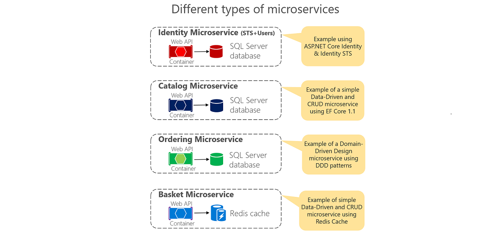
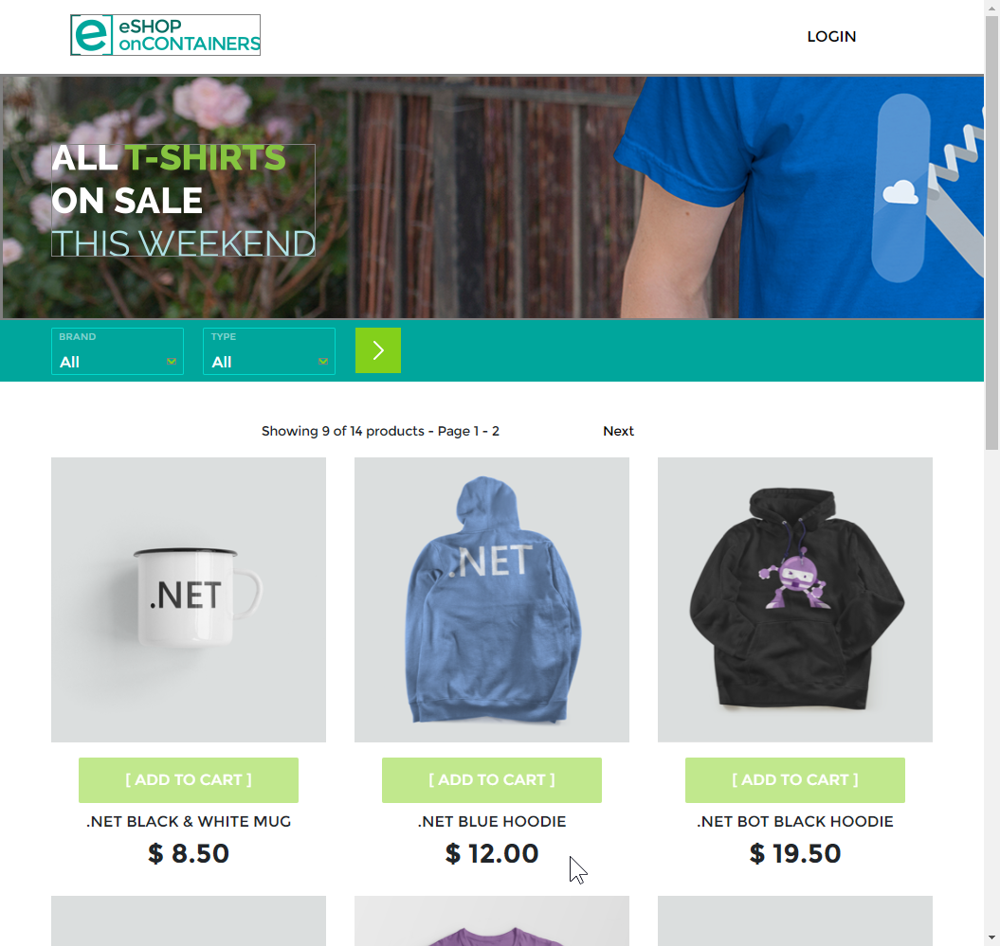

# eShopOnContainers - Microservices Architecture and Containers based Reference Application (**BETA state** - Visual Studio and CLI environments compatible)

Sample .NET Core reference application, powered by Microsoft, based on a simplified microservices architecture and Docker containers.

## Linux Build Status for 'dev' branch

Dev branch contains the latest "stable" code, and their images are tagged with `:dev` in our [Docker Hub](https://cloud.docker.com/u/eshop/repository/list):

| Basket API   | Catalog API | Identity API | Location API |
| ------------- | ------------- | ------------- | ------------- |
|  |  |  |  |

| Marketing API | Ordering API | Payment API | Api Gateways base image |
| ------------- | ------------- | ------------- | ------------- |
|  |  |  | 

| Web Shopping Aggregator | Mobile Shopping Aggregator | WebMVC Client | WebSPA Client |
| ------------- | ------------- | ------------- | ------------- |
|  |  |  |  |

| Web Status | Webhooks API | Webhooks demo client |
| ------------- | ------------- | ------------- |
  |  |  |

## Getting Started

eShopOnContainers is provided in "two flavors":

- Basic scenario: Can be run locally using docker compose, and also deployed to a local Kubernetes cluster
- Production scenario: Can only be deployed on a Kubernetes cluster (local or in the cloud like AKS), and enable production features like the use of a Service Mesh.

### Basic scenario

You can run eShop locally:

- [Using Visual Studio](https://github.com/dotnet-architecture/eShopOnContainers/wiki/Windows-setup)
- Using CLI or Visual Studio Code
- Using docker compose
- Using local Kubernetes

### Advanced scenario

The Advanced scenario can be run only in a Kubernetes cluster. Currently this scenario is the same as basic scenario with the following differences:

- Use of a Service Mesh for Resiliency

In the future more features will be implemented in the advanced scenario.

## IMPORTANT NOTES!

**You can use either the latest version of Visual Studio or simply Docker CLI and .NET CLI for Windows, Mac and Linux**.

**Note for Pull Requests (PRs)**: We accept pull request from the community. When doing it, please do it onto the **DEV branch** which is the consolidated work-in-progress branch. Do not request it onto **master** branch.

**NEWS / ANNOUNCEMENTS**
Do you want to be up-to-date on .NET Architecture guidance and reference apps like eShopOnContainers? --> Subscribe by "WATCHING" this new GitHub repo: https://github.com/dotnet-architecture/News

## Updated for .NET Core 3.0

eShopOnContainers is updated to .NET Core 3.0  "wave" of technologies. Not just compilation but also new recommended code in EF Core, ASP.NET Core, and other new related versions.

### Details on the latest mayor release

- Migrate solution from ASP.NET Core 2.2 to 3.0 and update all projects to use the latest .NET Core 3.0 templates.

- Implement the new .NET Core 3.0 WorkerService in Ordering.API and other background processes.

- Improve Ordering.API
  - Group order items
  - apply discounts from Marketing.API

- Handle two deployment scenarios
  - Basic deployment, better for learning:
    - Docker compose
    - Local Kubernetes
    - Visual Studio F5 experience

  - Advanced deployment, complex but more real-life:
    - Sidecar implementation with Envoy/Linkerd
    - Improved API Gateway and resilience
    - gRPC for inter-service communications
    - Test and Support Azure Dev Spaces

### New folder structure

The repo also has a new, simpler, folder structure, as shown in the following image:

In the above image you can see that the first folder level contains, basically:

- **build**: Scripts for building Docker images.
- **deploy**: Scripts for deployment.
- **src**: All source projects, including tests.
  - **ApiGateways**: Envoy configuration and Aggregators source code.
  - **BuildBlocks**: Common components used by several projects.
  - **Mobile**: Mobile apps projects.
  - **Services**: Backend for all services. Including unit and functional tests for some projects.
    - Basket
    - Catalog
    - Identity
    - Location
    - Marketing
    - Ordering
    - Payment
    - Webhooks
  - **Tests**: General functional application tests.
  - **test-results**: Test results
  - **Web**: Web applications

>**PLEASE** Read our [branch guide](./branch-guide.md) to know about our branching policy
>
> ### DISCLAIMER
>
> **IMPORTANT:** The current state of this sample application is **BETA**, because we are constantly evolving towards newly released technologies. Therefore, many areas could be improved and change significantly while refactoring the current code and implementing new features. Feedback with improvements and pull requests from the community will be highly appreciated and accepted.
>
> This reference application proposes a simplified microservice oriented architecture implementation to introduce technologies like .NET Core with Docker containers through a comprehensive application. The chosen domain is eShop/eCommerce but simply because it is a well-known domain by most people/developers.
However, this sample application should not be considered as an "eCommerce reference model" at all. The implemented business domain might not be ideal from an eCommerce business point of view. It is neither trying to solve all the problems in a large, scalable and mission-critical distributed system. It is just a bootstrap for developers to easily get started in the world of Docker containers and microservices with .NET Core.
>
> For example, the next step after running the solution in the local dev PC and understanding Docker containers and microservices development with .NET Core, is to select a microservice cluster/orchestrator like Kubernetes in Azure (AKS) or Azure Service Fabric, both environments tested and supported by this solution.
> Additional steps would be to move your databases to HA cloud services (like Azure SQL Database) or switch your EventBus to use Azure Service Bus (instead of bare-bone RabbitMQ) or any other production-ready Service Bus in the market.

> Read the planned [Roadmap](https://github.com/dotnet-architecture/eShopOnContainers/wiki/Roadmap) within the Wiki for further info about possible new implementations and provide feedback at the [ISSUES section](https://github.com/dotnet/eShopOnContainers/issues) if you'd like to see any specific scenario implemented or improved. Also, feel free to discuss on any current issue.

### Architecture overview

This reference application is cross-platform at the server and client side, thanks to .NET Core services capable of running on Linux or Windows containers depending on your Docker host, and to Xamarin for mobile apps running on Android, iOS or Windows/UWP plus any browser for the client web apps.
The architecture proposes a microservice oriented architecture implementation with multiple autonomous microservices (each one owning its own data/db) and implementing different approaches within each microservice (simple CRUD vs. DDD/CQRS patterns) using Http as the communication protocol between the client apps and the microservices and supports asynchronous communication for data updates propagation across multiple services based on Integration Events and an Event Bus (a light message broker, to choose between RabbitMQ or Azure Service Bus, underneath) plus other features defined at the [roadmap](https://github.com/dotnet-architecture/eShopOnContainers/wiki/Roadmap).

> ### Important Note on API Gateways and published APIs
>
> Since April 2018, we have introduced the implementation of the [API Gateway pattern](http://microservices.io/patterns/apigateway.html) and [Backend-For-Front-End (BFF) pattern](https://samnewman.io/patterns/architectural/bff/) in eShopOnContainers architecture, so you can filter and publish simplified APIs and URIs and apply additional security in that tier while hiding/securing the internal microservices to the client apps or outside consumers. These sample API Gateways in eShopOnContainers are based on [Envoy](https://www.envoyproxy.io/), an OSS, production-grade API Gateway and proxy [described in the official documentation page](https://www.envoyproxy.io/docs/envoy/latest/). The deployed API Gateways are autonomous and can be deployed as your own custom microservices/containers, as it is currently done in eShopOnContainers, so you can test it even in a simple development environment with just Docker engine or deploy it into orchestrators like Kubernetes in AKS or Service Fabric.
>
> For your production-ready architecture you can either keep using Envoy or, if you need further functionality and a much richer set of features suitable for commercial APIs, you can also substitute those API Gateways and use [Azure API Management](https://azure.microsoft.com/services/api-management/) or any other commercial API Gateway.

> The sample code in this repo is NOT making use of Azure API Management in order to be able to provide an "F5 experience" in Visual Studio (or CLI) of the sample with no up-front dependencies in Azure. But you could evaluate API Gateways alternatives when building for production.
>
> ### Internal architecture and design of the microservices
>
> The microservices are different in type, meaning different internal architecture pattern approaches depending on its purpose, as shown in the image below.

> ### Important Note on Database Servers/Containers
>
> In this solution's current configuration for a development environment, the SQL databases are automatically deployed with sample data into a single SQL Server container (a single shared Docker container for SQL databases) so the whole solution can be up and running without any dependency to any cloud or a specific server. Each database could also be deployed as a single Docker container, but then you'd need more than 8GB of RAM assigned to Docker in your development machine in order to be able to run 3 SQL Server Docker containers in your Docker Linux host in "Docker for Windows" or "Docker for Mac" development environments.
>
> A similar case is defined in regard to Redis cache running as a container for the development environment. Or a No-SQL database (MongoDB) running as a container.
>
> However, in a real production environment it is recommended to have your databases (SQL Server, Redis, and the NO-SQL database, in this case) in HA (High Available) services like Azure SQL Database, Redis as a service and Azure CosmosDB instead the MongoDB container (as both systems share the same access protocol). If you want to change to a production configuration, you'll just need to change the connection strings once you have set up the servers in an HA cloud or on-premises.
>
> ### Important Note on EventBus
>
> In this solution's current EventBus is a simplified implementation, mainly used for learning purposes (development and testing), so it doesn't handle all production scenarios, most notably on error handling.
> The following fork provides production environment level implementation examples with eShopOnContainers:
>
> - Implementation with [NServiceBus](https://github.com/Particular/NServiceBus) : <https://github.com/Particular/eShopOnContainers>

## Related documentation and guidance

You can find the related reference **Guide/eBook** focusing on **architecting and developing containerized and microservice based .NET Applications** (download link available below) which explains in detail how to develop this kind of architectural style (microservices, Docker containers, Domain-Driven Design for certain microservices) plus other simpler architectural styles, like monolithic apps that can also live as Docker containers.

There are also additional eBooks focusing on Containers/Docker lifecycle (DevOps, CI/CD, etc.) with Microsoft Tools, already published plus an additional eBook focusing on Enterprise Apps Patterns with Xamarin.Forms.
You can download them and start reviewing these Guides/eBooks here:

| Architecting & Developing | Containers Lifecycle & CI/CD | App patterns with Xamarin.Forms |
| ------------ | ------------|  ------------|
|  |  |  |
|  <a href='https://aka.ms/microservicesebook'>**Download .PDF**</a>   |  <a href='https://aka.ms/dockerlifecycleebook'>**Download** </a>   |  <a href='https://aka.ms/xamarinpatternsebook'>**Download**  </a>   |

Download in other formats (**eReaders** like **MOBI**, **EPUB**) and other eBooks at the [.NET Architecture center](http://dot.net/architecture).

Send feedback to [dotnet-architecture-ebooks-feedback@service.microsoft.com](dotnet-architecture-ebooks-feedback@service.microsoft.com)

However, we encourage you to download and review the [Architecting and Developing Microservices eBook](https://aka.ms/microservicesebook) because the architectural styles and architectural patterns and technologies explained in the guide are using this reference application when explaining many pattern implementations, so you'll understand the context, design and decisions taken in the current architecture and internal designs much better.

## Overview of the application code

In this repo you can find a sample reference application that will help you to understand how to implement a microservice architecture based application using **.NET Core** and **Docker**.

The example business domain or scenario is based on an eShop or eCommerce which is implemented as a multi-container application. Each container is a microservice deployment (like the basket-microservice, catalog-microservice, ordering-microservice and the identity-microservice) which is developed using ASP.NET Core running on .NET Core so they can run either on Linux Containers and Windows Containers.
The screenshot below shows the VS Solution structure for those microservices/containers and client apps.

- (*Recommended when getting started*) Open **eShopOnContainers-ServicesAndWebApps.sln** for a solution containing just the server-side projects related to the microservices and web applications.
- Open <b>eShopOnContainers-MobileApps.sln</b> for a solution containing just the client mobile app projects (Xamarin mobile apps only). It works independently based on mocks, too.
- Open <b>eShopOnContainers.sln</b> for a solution containing all the projects (All client apps and services).

Finally, those microservices are consumed by multiple client web and mobile apps, as described below.
 
<b>*MVC Application (ASP.NET Core)*</b>: It's an MVC application where you can find interesting scenarios on how to consume HTTP-based microservices from C# running in the server side, as it is a typical ASP.NET Core MVC application. Since it is a server-side application, access to other containers/microservices is done within the internal Docker Host network with its internal name resolution.

 
<b>*SPA (Single Page Application)*</b>: Providing similar "eShop business functionality" but developed with Angular, Typescript and slightly using ASP.NET Core MVC. This is another approach for client web applications to be used when you want to have a more modern client behavior which is not behaving with the typical browser round-trip on every action but behaving like a Single-Page-Application which is more similar to a desktop app usage experience. The consumption of the HTTP-based microservices is done from TypeScript/JavaScript in the client browser, so the client calls to the microservices come from out of the Docker Host internal network (Like from your network or even from the Internet).

 
<b>*Xamarin Mobile App (For iOS, Android and Windows/UWP)*</b>: It is a client mobile app supporting the most common mobile OS platforms (iOS, Android and Windows/UWP). In this case, the consumption of the microservices is done from C# but running on the client devices, so out of the Docker Host internal network (Like from your network or even the Internet).

## Setting up your development environment for eShopOnContainers

### Windows based (CLI and Visual Studio)

<https://github.com/dotnet-architecture/eShopOnContainers/wiki/Windows-setup>

### Mac based (CLI and Visual Studio for Mac)

<https://github.com/dotnet-architecture/eShopOnContainers/wiki/Mac-setup>

## Orchestrators: Kubernetes and Service Fabric

See at the [Wiki](https://github.com/dotnet-architecture/eShopOnContainers/wiki) the posts on setup/instructions about how to deploy to Kubernetes or Service Fabric in Azure (although you could also deploy to any other cloud or on-premises).

## Sending feedback and pull requests

As mentioned, we'd appreciate your feedback, improvements and ideas.
You can create new issues at the issues section, do pull requests and/or send emails to **eshop_feedback@service.microsoft.com**
