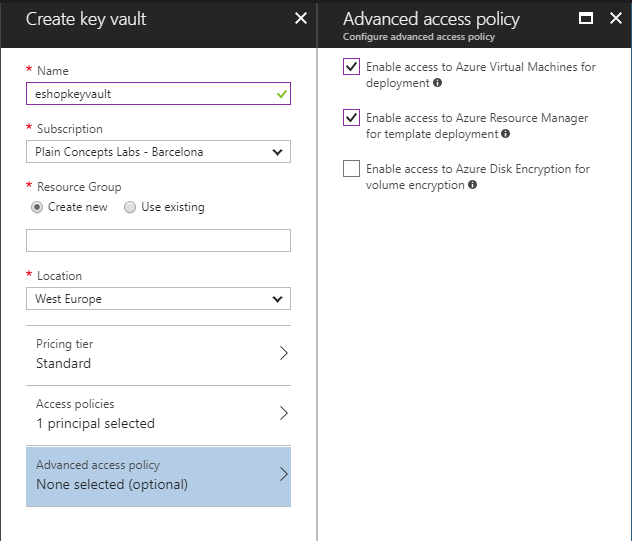
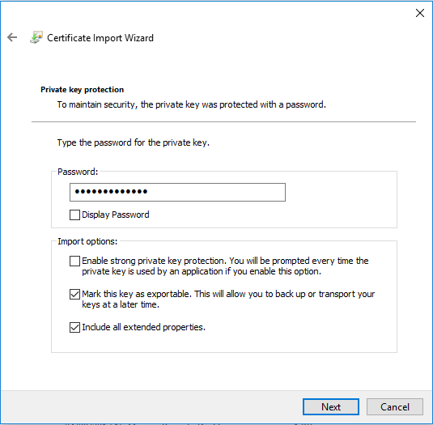
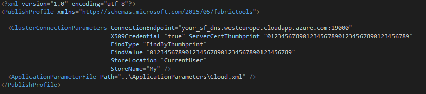

# Deploying a Service Fabric cluster based on Windows nodes 

## A. Unsecured cluster (SF Windows cluster)
For a secured cluster, see option B. below.

You can always deploy a SF cluster through the Azure portal, as explained in this article: https://docs.microsoft.com/en-us/azure/service-fabric/service-fabric-get-started-azure-cluster

However, when creating a cluster, there are quite a few configurations to take into account, like enabling the internal DNS service or Reverse Proxy service, choosing between Linux/Windows, open/publish your application ports in the load-balancer and most of all (the most complex setup) how to create a secure cluster.

Because of those reasons, we have created a set of ARM templates and scripts so you can create, re-create and configure the SF clusters much faster, as explained below: 

Within eShopOnContainers root folder, at the folder [..\deploy\az\servicefabric\WindowsContainers](https://github.com/dotnet-architecture/eShopOnContainers/tree/dev/deploy/az/servicefabric/WindowsContainers), you can find the ARM template `servicefabricdeploy.json` and its parameters file (`servicefabricdeploy.parameters.json`) to create a Service Fabric cluster environment for Windows Containers (NOT SECURED CLUSTER).

## Edit the servicefabricdeploy.parameters.json file

Edit the following params in `servicefabricdeploy.parameters.json` file to set your values:

- clusterName: Name of your SF cluster
- clusterLocation: Datacenter location, like westus or westeurope
- computeLocation: Datacenter location, like westus or westeurope
- adminUserName: user-name for VMs administration
- adminPassword: user-password for VMs administration
- dnsName: Name assigned to your SF dns

Optionally, you could modify which ports are opened in the LoadBalancer for the multiple eShopOnContainer apps and API services.
By default, they are setup as:
- webMvcHttpPort:       5100
- webSpaHttpPort:       5104
- webStatusHttpPort:    5107
- IdSrvHttpRule:        5105
- BasketApiHttpRule:    5103
- CatalogApiHttpRule:   5101
- OrderingApiHttpRule:  5102
- MarketingApiHttpRule: 5110
- LocationsApiHttpRule: 5109

## Deploy the Service Fabric cluster using the script and ARM templates

Once parameter file is edited you can deploy it using [create-resources script](../readme.md).

For example, to deploy the cluster to a new resourcegroup located in westus, using the Command Prompt, go to `deploy\az` folder and type:
```
create-resources.cmd servicefabric\WindowsContainers\servicefabricdeploy qa-eshop-sfwin-resgrp -c westus
```

You should see a similar execution to the following:
++++++++++++ IMAGE TBD ++++++++++++++

Now, if you go to your subscription in Azure, you should be able to see the SF cluster already created and available, like in the following image:

++++++++++++ IMAGE TBD ++++++++++++++

In this case, this is an unsecured SF cluster with a single Windows node, good for initial tests and getting started with SF.


## B. Secured cluster (SF Windows cluster)

Within eShopOnContainers root folder, at the folder [..\deploy\az\servicefabric\WindowsContainers](https://github.com/dotnet-architecture/eShopOnContainers/tree/dev/deploy/az/servicefabric/WindowsContainers), you can find the ARM template `servicefabricdeploysecured.json` and its parameter file (`servicefabricdeploysecured.parameters.json`) to create a secured Service Fabric cluster environment for Windows Containers (IN THIS CASE, IT IS A SECURED CLUSTER USING A CERTIFICATE).

## Create Azure Keyvault service
Go to PortalAzure and create a Keyvault service. Make sure Enable access for deployment checkboxes are selected.



## Generate a certificate in Azure Keyvault
Execute the gen-keyvaultcert.ps1 script to generate and download a certificate from Keyvault.

```
.\gen-keyvaultcert.ps1 -vaultName <your_keyvault_service> -certName <your_cert_name> -certPwd <your_cert_pwd> -subjectName CN=<your_sf_dns_name>.westeurope.cloudapp.azure.com -saveDir C:\Users\<user>\Downloads

```
## Install the certificate
Install the certificate under 'Current User' store location and check it as exportable.



## Editing servicefabricdeploysecured.parameters.json file

Edit the following params in `servicefabricdeploysecured.parameters.json` file to set your values:

- clusterName: Name of your SF cluster
- dnsName: Name assigned to your SF dns
- adminUserName: user name for administration
- adminPassword: user password for administration
- sourceVaultValue: keyvault resource id (check azure keyvault properties)
- certificateUrlValue: certificate url (check azure Keyvault certificate properties)
- certificateThumbprint: certificate thumbprint (check azure Keyvault certificate properties)

Optionally, you can modify which ports are opened in the LoadBalancer for accessing externally to the apps:

- webMvcHttpPort: port externally exposed for the WebMVC app
- webSpaHttpPort: port externally exposed for the WebSPA app
- webStatusHttpPort: port externally exposed for the WebStatus app
- IdSrvHttpRule: port externally exposed for the Identity app

## Deploy the template

Once parameter file is edited you can deploy it using [create-resources script](../readme.md).

```
create-resources.cmd servicefabric\WindowsContainers\servicefabricdeploysecured newResourceGroup -c westus
```
## Deploy eShopOnServiceFabric with Visual Studio.

Modify the cloud.xml file of each Service Fabric application in PublishProfile directory and set  your certificate settings to be able to deploy eshopOnContainers in the secured cluster:




