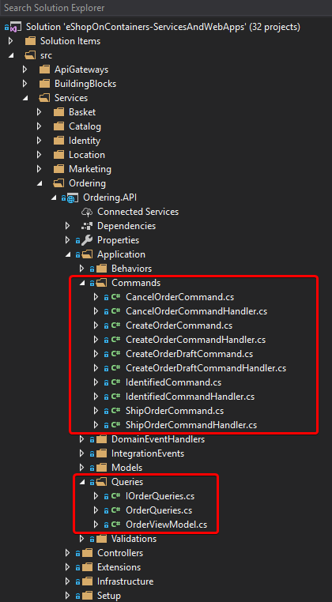
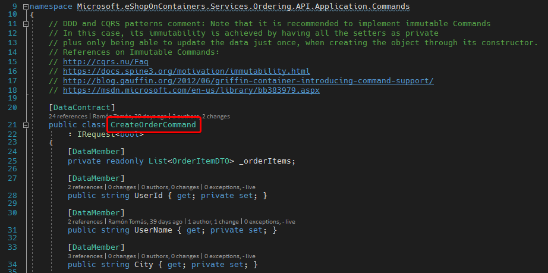
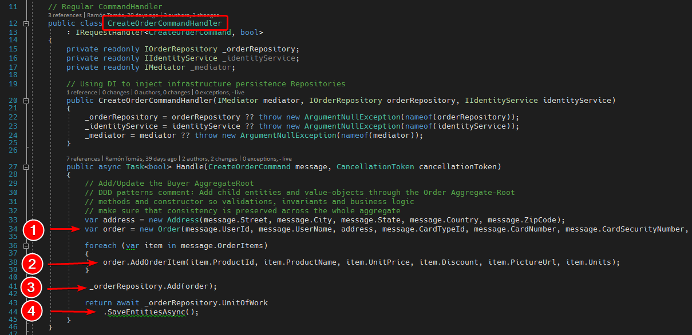
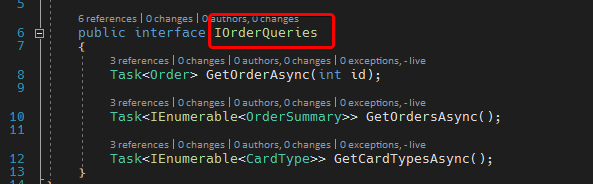
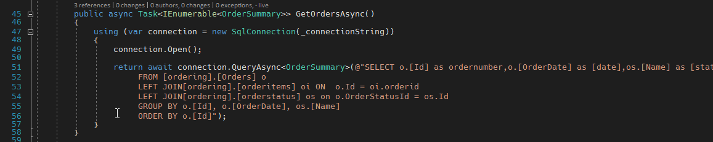
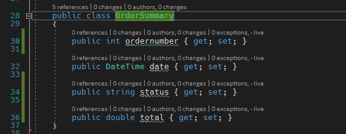
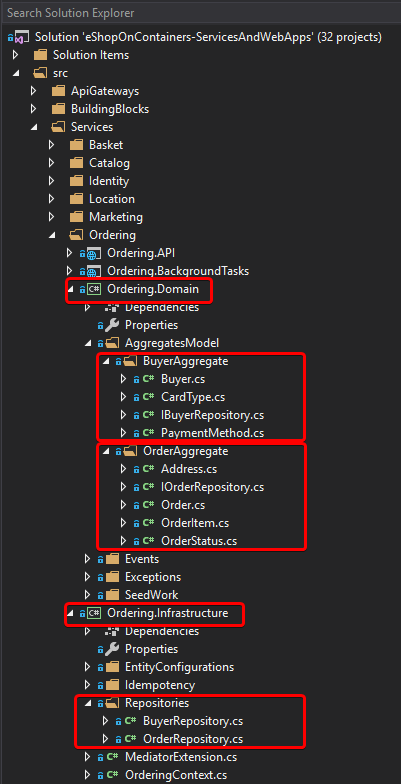

Simplified CQRS and DDD
=======================

CQRS, for Command and Query Responsibility Segregation, is an architectural pattern that, in very simple terms, has two different ways to handle the application model.

**Commands** are responsible for **changing** the application state, i.e. creating, updating and deleting entities (data).

**Queries** are responsible for **reading** the application state, e.g. to display information to the user.

**Commands** are made thinking about the Domain rules, restrictions and transaction boundaries.

**Queries** are made thinking about the presentation layer, the client UI.

When handling **commands**, the application model is usually represented by DDD constructs, e.g. Root aggregates, entities, value objects, etc., and there are usually some sort of rules that restrict the allowed state changes, e.g. An order has to be paid before dispatching.

When handling **queries**, the application model is usually represented by entities and relations and can be read much like SQL queries to display information.

Queries don't change state, so they can be run as much as required and will always return the same values (as long as the application state hasn't changed), i.e. queries are "idempotent".

Why the separation? because the rules for **changing** the model can impose unnecessary constraints for **reading** the model, e.g. you might allow to change order items only before dispatching so the order is like the gate-keeper (root aggregate) to access the order items, but you might also want to view all orders for some catalog item, so you have to be able to access the order items first (in a read only way).

In this simplified CQRS approach both the DDD model and the query model use the same database.

**Commands** and **Queries** are located in the Application layer, because:

1. It's where the composition of domain root aggregates occur (commands) and
2. It's close to the UI requirements and has access to the whole database of the microservice (queries).
 
Ideally, root aggregates are ignorant of each other and it's the Application layer's responsibility to compose coordinated actions by means of domain events, because it knows about all root aggregates.

Regarding **queries**, in a similar analysis, the Application layer knows about all entities and relationships in the database, beyond the restrictions of the root aggregates.

Code
----

### CQRS
The CQRS pattern can be checked in the Ordering service:

Commands and queries are clearly separated in the application layer (Ordering.API).

**Solution Explorer [Ordering.API]:**  

Commands are basically read only Data Transfer Objects (DTO) that contain all data that's required to execute the operation.

**CreateOrderCommand:**  

Each command has a specific command handler that's responsible for executing the operations intended for the command.

**CreateOrderCommandHandler:**  

In this case:

1. Creates an Order object (root aggregate)
2. Adds the order items using the root aggregate method
3. Adds the order through the repository
4. Saves the order

Queries, on the other hand, just return whatever the UI needs, could be a domain object or collections of specific DTOs.

**IOrderQueries:**  

And they are implemented as plain SQL queries, in this case using [Dapper](http://dapper-tutorial.net/ as the ORM.

**OrderQueries:**  

There can even be specific ViewModels or DTOs just to get the query results.

**OrderViewModel:**  

### DDD
The DDD pattern can be checked in the domain layer (Ordering.Domain)

**Solution Explorer [Ordering.Domain + Ordering.Infrastructure]:**  

There you can see the Buyer aggregate and the Order aggregate, as well as the repository implementations in Ordering.Infrastructure.

Command handlers from the application layer use the root aggregates from the Domain layer and the repository implementations from the Infrastructure layer, the latter through Dependency Injection.

Further reading
---------------

* **Issue #592 - [Question] Ordering Queries**    https://github.com/dotnet-architecture/eShopOnContainers/issues/592

* **Applying simplified CQRS and DDD patterns in a microservice**  
https://docs.microsoft.com/en-us/dotnet/standard/microservices-architecture/microservice-ddd-cqrs-patterns/apply-simplified-microservice-cqrs-ddd-patterns

