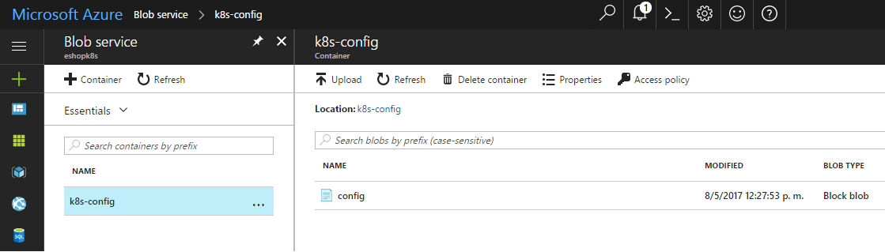
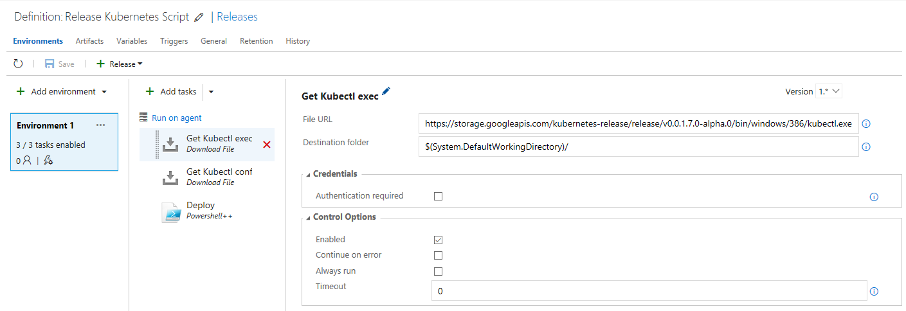
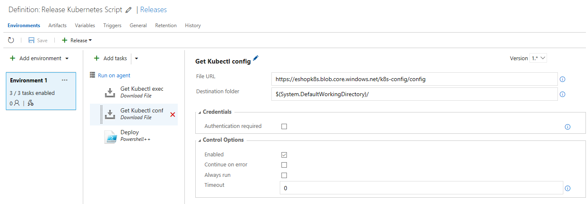
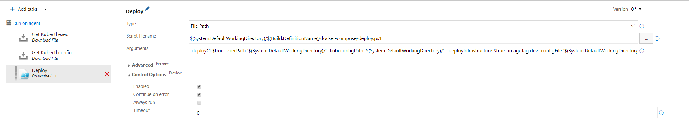

# Kubernetes CI/CD VSTS
For k8s CI/CD pipeline delivery a series of tasks must be created in VSTS to deploy k8s in Azure

## Prerequisites
* A Kubernetes cluster. Follow Azure Container Service's [walkthrough](https://docs.microsoft.com/en-us/azure/container-service/container-service-kubernetes-walkthrough) to create one. 
* A private Docker registry. Follow Azure Container Registry's [guide](https://docs.microsoft.com/en-us/azure/container-registry/container-registry-get-started-portal) to create one.
* Optionally, previous steps can be skipped if you run gen-k8s-env.ps1 (or gen-k8s-env-aks.ps1 if you would like to use AKS instead of ACS) script to automatically create the azure environment needed for kubernetes deployment. Azure cli 2.0 must be previously installed [installation guide](https://docs.microsoft.com/en-us/cli/azure/install-azure-cli). For example:

>```
>./gen-k8s-env -resourceGroupName k8sGroup -location westeurope -registryName k8sregistry -orchestratorName k8s-cluster -dnsName k8s-dns
>```
or using AKS instead of ACS
>```
>./gen-k8s-env-aks -resourceGroupName k8sGroup -location westeurope -registryName k8sregistry -dnsName k8s-dns -serviceName k8s-cluster -createAcr true -nodeCount 3 -nodeVMSize Standard_D2_v2
>```
* An `Azure Blob storage`. It is needed for storing the kubernetes config file used by the hosted agent to access to Kubernetes cluster. Example:



* Upload the `kubernetes config file` to the blob storage previously created. Execute the following command which will download the config file into the directory `c:\Users\<User>\.kube\` and then, upload it to your blob storage: 

>```
>https://eshopk8s.blob.core.windows.net/k8s-config/config
>```

## Create the VSTS tasks
1. Create a `Download File` task to download the kubernetes binary `kubectl` to the hosted agent. For example:

>```
>https://storage.googleapis.com/kubernetes-release/release/v1.8.5/bin/windows/386/kubectl.exe
>```



2. Create a Download File task to download the kubernetes config file to the hosted agent. For example:

>```
>https://eshopk8s.blob.core.windows.net/k8s-config/config
>```


3. Create a powershell task to execute the k8s deployment script. For example:

* Deployment script path

>```
>$(System.DefaultWorkingDirectory)/All Microservices/docker-compose/deploy.ps1
>```

* Deployment script path arguments. Use value: 

>```
>-deployCI $true -execPath '$(System.DefaultWorkingDirectory)/' -kubeconfigPath '$(System.DefaultWorkingDirectory)/'  -deployInfrastructure $true -imageTag dev -configFile '$(System.DefaultWorkingDirectory)/$(Build.DefinitionName)/docker-compose/conf_local.yml'
>```


- deployCI: Must be set to `$true`. This avoids create images (always are pulled from registry) and compile bits.
- deployInfrastructure: Can be set to `$false` if don't want to deploy infrastructure containers (like Redis, rabbit, SQL,...).
- imageTag: Image tag to pull from k8s.
- configFile: Configuration file (refer to [README.k8s.md](./README.k8s.md) for more info). This file is part of the VSTS build output.
- execPath: path where the k8s binary is stored
- kubeconfigPath: path where the k8s config file is stored

 You can use additional parameters (i.e. pass registry and user/password to use custom registry instead of DockerHub. Plase, refer to [README.k8s.md](./README.k8s.md) for more info.


