# eShopOnContainers

eShopOnContainers is a reference app whose imagined purpose is to serve the mobile workforce of a fictitious company that sells products. The app allow to manage the catalog, view products, manage the basket and the orders.

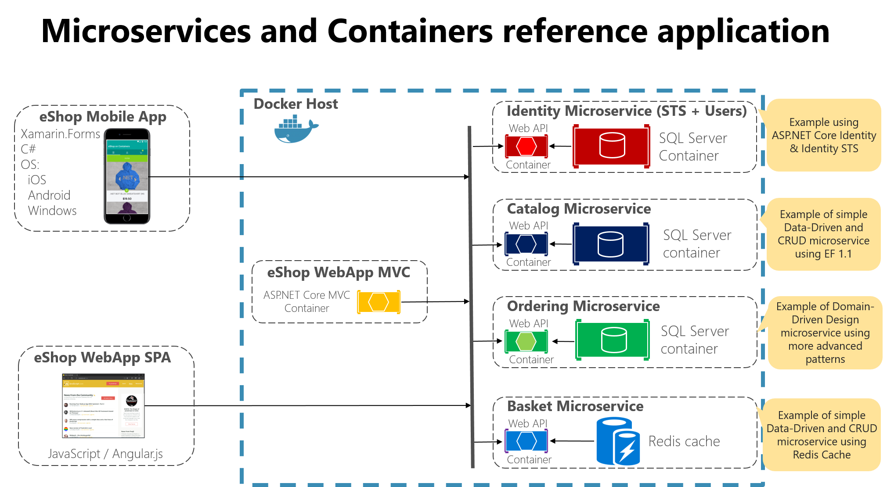

### Supported platforms: iOS, Android and Windows

### The app architecture consists of two parts:
  1. A Xamarin.Forms mobile app for iOS, Android and Windows.
  2. Several .NET Web API microservices deployed as Docker containers.

### Xamarin.Forms App (eShopOnContainers)

This project exercises the following platforms, frameworks or features:

* Xamarin.Forms
  * XAML
  * Behaviors
  * Bindings
  * Converters
  * Central Styles
  * Custom Renderers
  * Animations
  * IoC
  * Messaging Center
  * Custom Controls
  * Cross Plugins
  * XFGloss
* xUnit Tests
* Azure Mobile Services
  * C# backend
  * WebAPI
  * Entity Framework
  * Identity Server 4

## Three platforms
The app targets **three** platforms:

* iOS
* Android
* Universal Windows Platform (UWP)
    * UWP supported only in Visual Studio, not Xamarin Studio or Visual Studio for MacOS

As of 07/03/2017, eShopOnContainers features **89.2% code share** (7.2% iOS / 16.7% Android / 8.7% Windows).

## Licenses

This project uses some third-party assets with a license that requires attribution:

- [Xamarin.Plugins](https://github.com/jamesmontemagno/Xamarin.Plugins): by James Montemagno
- [FFImageLoading](https://github.com/daniel-luberda/FFImageLoading): by Daniel Luberda
- [ACR User Dialogs](https://github.com/aritchie/userdialogs): by Allan Ritchie
- [Xamarin.Forms Animation Helpers](https://github.com/jsuarezruiz/Xamanimation): by Javier Suárez
- [SlideOverKit](https://github.com/XAM-Consulting/SlideOverKit): by XAM-Consulting

## Requirements
### Requirements for March 2017 version of eShopOnContainers

* [Visual Studio __2015__](https://www.visualstudio.com/en-us/products/vs-2015-product-editions.aspx) (14.0 or higher) to compile C# 6 langage features (or Visual Studio MacOS)
* Xamarin add-ons for Visual Studio (available via the Visual Studio installer)
* __Visual Studio Community Edition is fully supported!__
* [Android SDK Tools](https://developer.xamarin.com/guides/android/getting_started/installation/windows/) 25.2.3 or higher
* JDK 8.0

## Setup

#### [1. Ensure the Xamarin platform is installed](http://developer.xamarin.com/guides/cross-platform/getting_started/installation/)

#### 2. Ensure Xamarin are updated
Xamarin will periodically automatically check for updates. You can also manually check for updates.

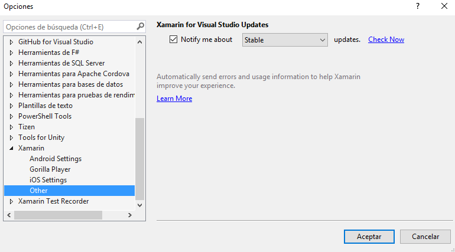

### 3. Project Setup

Restore NuGet packages for the project.

### 4. Ensure Android Emulator is installed
You can use any Android emulator although it is highly recommended to use an x86 based version.

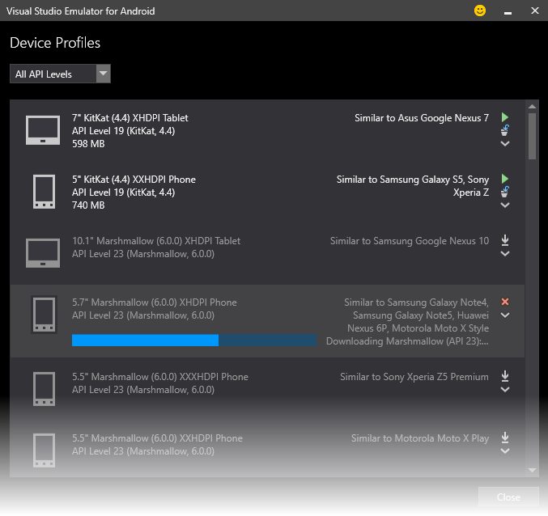

**Note**: The Visual Studio Android Emulator cannot run well inside a virtual machine or over Remote Desktop or VNC since it relies on virtualization and OpenGL. 

To deploy and debug the application on a physical device, refer to these [link](https://developer.xamarin.com/guides/android/deployment,_testing,_and_metrics/debug-on-device/).

### 5. Ensure Mac connection
To set up the Mac host, you must enable communication between the Xamarin extension for Visual Studio and your Mac.

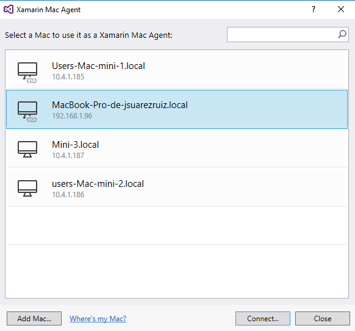

## Screens

The app has the following screens:

* a auth screen
* a catalog list
* a profile section with a order list
* a readonly order detail screen
* a customizable basket
* a checkout screen

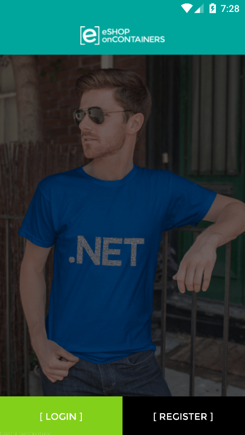
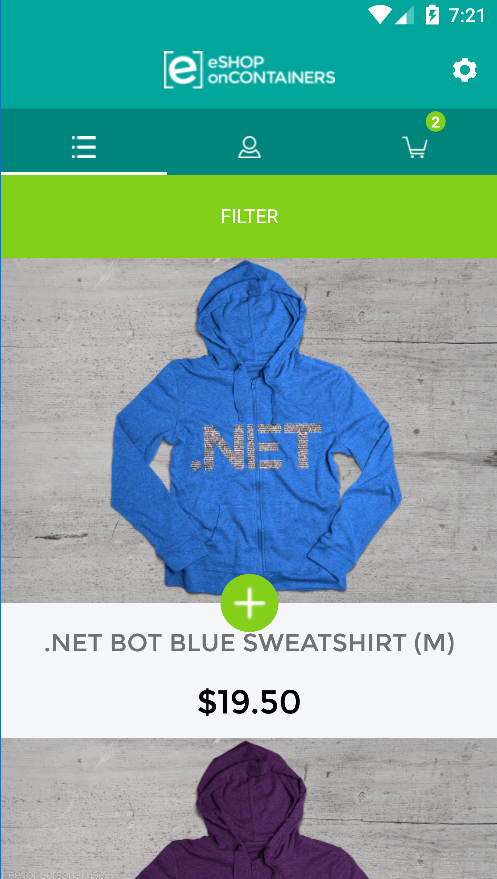
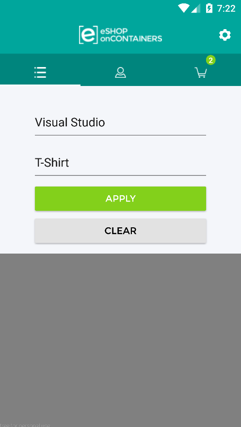
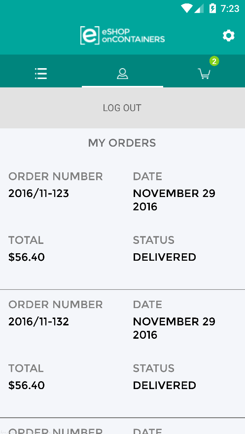

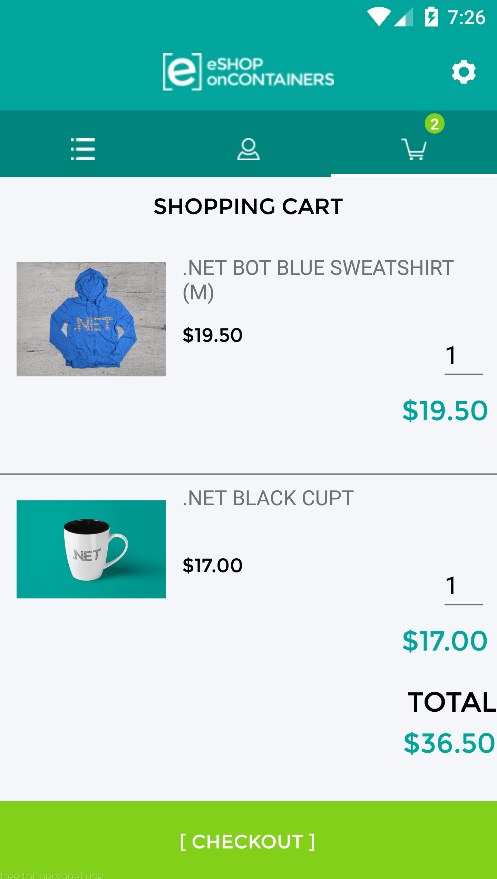
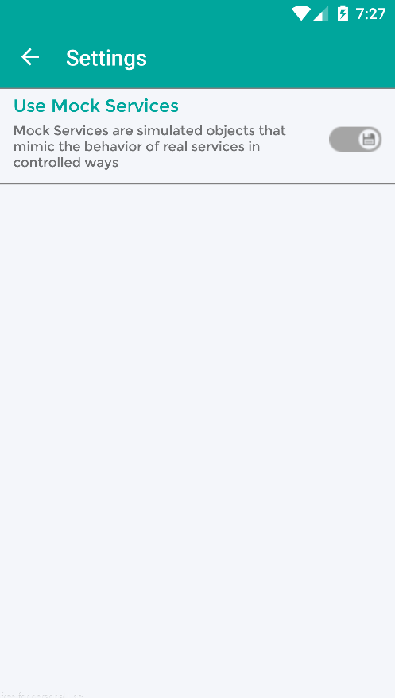

## Clean and Rebuild
If you see build issues when pulling updates from the repo, try cleaning and rebuilding the solution.

## Troubleshooting

**Unsupported major.minor version 52.0**

So, you just downloaded the source code and ready to build the application and... 

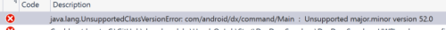

We have two possible fixes.

The first one is based on updating Java JDK and ensure its use. The version 52.0 referenced in the error refers to the JDK, specifically to version 8. Xamarin Android 7.0 requires the JDK 1.8 to use the Android Nougat APIs (API Level 24). It is also necessary a 64-bit version to be able to use personal controls in the Android editor among other actions.

Download the corresponding version of the JDK in this [link](http://www.oracle.com/technetwork/java/javase/downloads/jdk8-downloads-2133151.html).

After downloading and installing, we must ensure that the installed version is used. For that:

Visual Studio: Tools> Options> Xamarin> Android Settings> Java Development Kit Location.
Xamarin Studio (on Mac): Xamarin Studio> Preferences> Projects> SDK Locations> Android> Java SDK (JDK).

The second way is based on using Android 6.0 or what is the same API Level 23.

**Could not connect to the debugger using Android Hyper-V emulators**

The application performs the deployment and even boots into the emulator, but stops immediately without allowing debugging. We get the message:

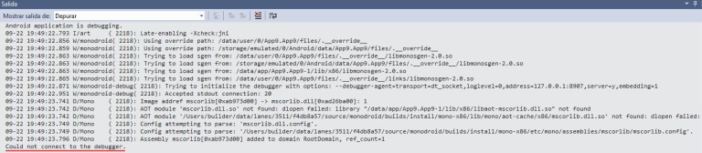

The error is related with incompatibilities between the host processor and the Hyper-V virtual machine.

In Windows 10, we press the start button and write MMC. Next, click the Hyper-V Manager option:

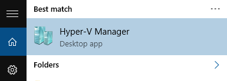

In the Hyper-V machine management tool (emulators) we select the one that we want to use and we right click, Settings.

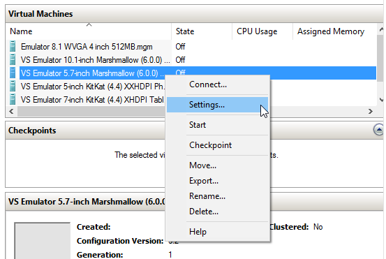

In the configuration window of the machine, go to the Compatibility section and enable **Migrate to a physical computer with a different processor version**:

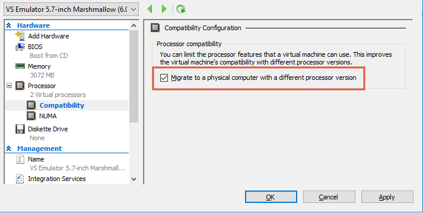

## Copyright and license
* Code and documentation copyright 2017 Microsoft Corp. Code released under the [MIT license](https://opensource.org/licenses/MIT).
