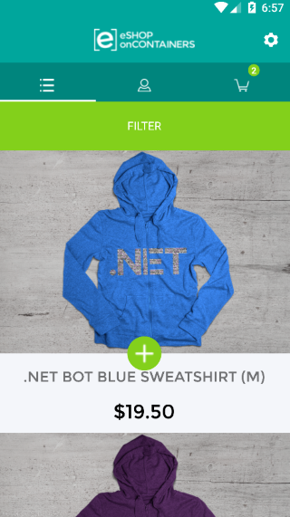

#eShopOnContainers

eShopOnContainers is a reference app whose imagined purpose is to serve the mobile workforce of a fictitious company that sells products. The app allow to manage the catalog, view products, manage the basket and the orders.

###Try it out:
You can download and build the app's source as-is, preconfigured to consume our Azure service instance. 

###Supported platforms: iOS, Android and Windows

###The app architecture consists of two parts:
  1. A Xamarin.Forms mobile app for iOS, Android and Windows.
  2. A .NET Web API-backed Entity Framework based Azure Mobile Service for data.

**The Azure Mobile Service does not need to be deployed by you.** There is already an instance of the service up and running in Azure, and the mobile app is configured by default to consume that service instance. We've included the code for the service so that you may run your own service instance on Azure if you'd like. 

##Xamarin.Forms App (eShopOnContainers)

This project exercises the following platforms, frameworks or features:

* Xamarin.Forms
  * XAML
  * Bindings
  * Converters
  * Central Styles
  * Custom Renderers
  * Animations
  * IoC
  * Messaging Center
  * Custom Controls
  * Cross Plugins
  * XFGloss
* xUnit Tests
* Azure Mobile Services
  * C# backend
  * WebAPI
  * Entity Framework
  * Identity Server 4

##Three platforms
The app targets **three** platforms:

* iOS
* Android
* Universal Windows Platform (UWP)
    * UWP supported only in Visual Studio, not Xamarin Studio

As of 29/11/2016, eShopOnContainers features **89.2% code share** (7.2% iOS / 16.7% Android / 8.7% Windows).

## Requirements
* [Visual Studio __2015__](https://www.visualstudio.com/en-us/products/vs-2015-product-editions.aspx) (14.0 or higher) to compile C# 6 langage features (or Visual Studio MacOS)
* Xamarin add-ons for Visual Studio (available via the Visual Studio installer)
* __Visual Studio Community Edition is fully supported!__

## Setup

#### [1. Ensure the Xamarin platform is installed](http://developer.xamarin.com/guides/cross-platform/getting_started/installation/)

#### 2. Ensure Xamarin are updated
Xamarin will periodically automatically check for updates. You can also manually check for updates.

### 3. Project Setup

Restore NuGet packages for the project.

### 4. Ensure Android Emulator is installed
You can use any Android emulator although it is highly recommended to use an x86 based version.

**Note**: The Visual Studio Android Emulator cannot run well inside a virtual machine or over Remote Desktop or VNC since it relies on virtualization and OpenGL. 

To deploy and debug the application on a physical device, refer to these [link](https://developer.xamarin.com/guides/android/deployment,_testing,_and_metrics/debug-on-device/).

### 5. Ensure Mac connection
To set up the Mac host, you must enable communication between the Xamarin extension for Visual Studio and your Mac.

## Screens

The app has the following screens:

* a auth screen
* a catalog list
* a profile section with a order list
* a readonly order detail screen
* a customizable basket
* a checkout screen

## Clean and Rebuild
If you see build issues when pulling updates from the repo, try cleaning and rebuilding the solution.

## Copyright and license
* Code and documentation copyright 2016 Microsoft Corp. Code released under the [MIT license](https://opensource.org/licenses/MIT).