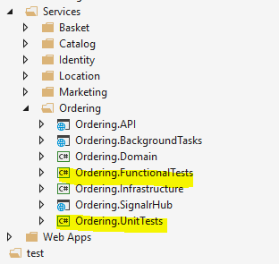
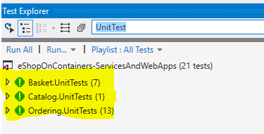
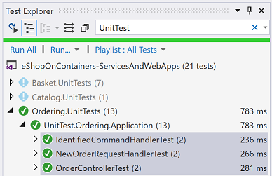
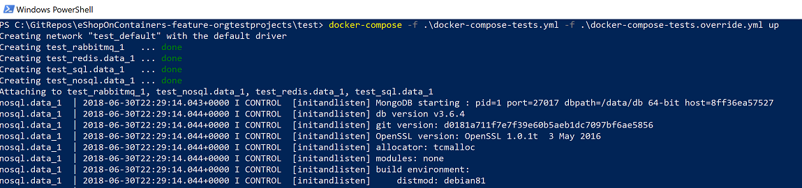
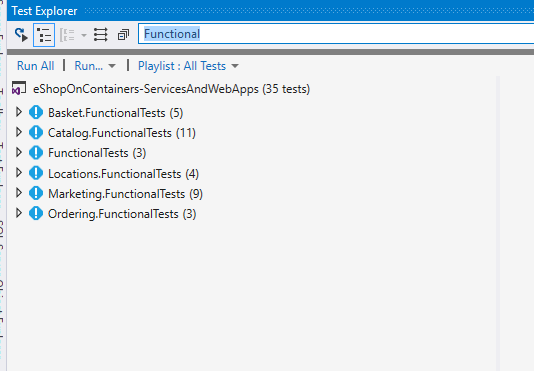
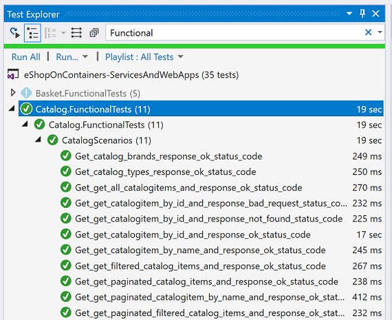
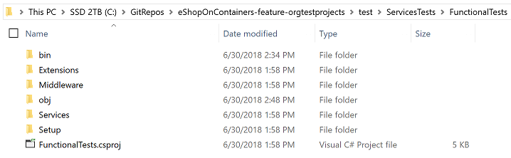
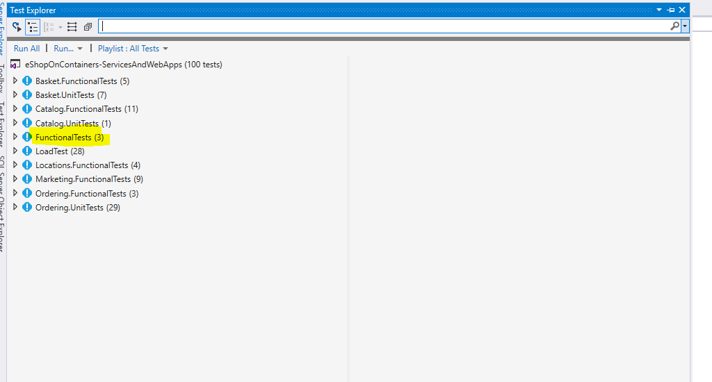
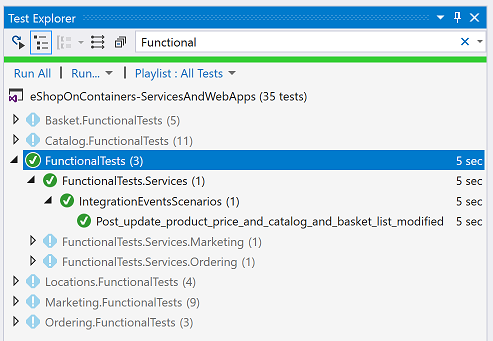

# Running Tests for eShopOnContainers

The tests in eShopOnContainers are structured in the following structure, per type:

- Tests per microservice
    - Unit Tests
    - Functional/Integration Tests

- Global application tests
    - Microservices Functional/Integration Tests across the whole application

# Unit and Functional tests per microservice

Within each microservice's folder there are multiple tests (Unit Tests and Functional Tests) available to validate its behaviour.
The test projects are positioned within each microservice's physical folder because that helps on the goal of maitanining maximum development autonomy per microservice. Doing it this way and in a more advance scenario, you could even move each microservice to a different GitHub repo per microservice, along with its test projects. 

For instance, this is the way you see the project folders for the *Ordering* microservice, where you also have the *Ordering.FunctionalTests* y *Ordering.UnitTests* within that folder structure.

<p>

<p>

## Running Unit Tests for specific microservices

In order to run the Unit Tests for any microservice, you just need to select the tests with [*Test Explorer* in Visual Studio](https://docs.microsoft.com/en-us/visualstudio/test/run-unit-tests-with-test-explorer) (or use your preferred tool) and run the tests. 

For instance, you can filter and see just the Unit Test projects by typing *"UnitTest"* in the filter edit box within **Test Explorer**:

<p>

<p>

Then you can run all or selected tests, like in the following image:

<p>

<p>

These Unit Tests have no any dependency with any external infrastructure or any other microservice and that's why you don't need to spin-up additional infrastructure (Database server or additional containers).


## Running Functional/Integration Tests for specific microservices

In this case, the Functional Tests do have dependencies with additional infrastructure. For instance, they might have dependencies with the microservices's database in the SQL Server container, the messaging broker (RabbitMQ container), etc.

Therefore, in order to run the Functional Tests you first need to have the needed inrastructure, in this case to spin-up the infrastructure containers.

In order to facilitate how you can have the infrastructure containers up and running, you have certain docker-compose files you can use with `docker-compose up`. These files are available here:

https://github.com/dotnet-architecture/eShopOnContainers/tree/feature/orgtestprojects/test

If you edit the docker-compose-tests.yml you can see that it just have info about the infrastructure containers to spin up:

```
docker-compose-tests.yml

version: '3'
services:
  redis.data:
    image: redis:alpine
  rabbitmq:
    image: rabbitmq:3-management-alpine
  sql.data:
    image: microsoft/mssql-server-linux:2017-latest
  nosql.data:
    image: mongo
```

Here is how you start the infrastructure containers with "docker-compose up" in PowerShell or any Command-Line window:

> docker-compose -f .\docker-compose-tests.yml -f .\docker-compose-tests.override.yml up

<p>

<p>

Each Functional Test project uses a [TestServer](https://docs.microsoft.com/en-us/dotnet/api/microsoft.aspnetcore.testhost.testserver?view=aspnetcore-2.1) configured with the required infrastructure which should be available thanks to the previous "docker-compose up", so the Functional Tests can be run.

> For more info about **TestServer** and *Functional Tests* and *Integration Tests*, see the article [Integration tests in ASP.NET Core](https://docs.microsoft.com/aspnet/core/test/integration-tests?view=aspnetcore-2.1).

In order to filter and see the Functional Tests to run, type *"Functional"* in **Test Explorer**. 

<p>

<p>

You can, for instance, run the Functional Tests for the Catalog Microservice, which, under the covers, are accessing to the SQL Server container that should be running in Docker:

<p>

<p>


# Running Services Integration Tests (Tests across the whole application)

So far, we've been focusing on isolated Unit Tests or Functional Tests that were related to single/isolated microservices, although taking into account the infrastructure for the functional tests per microservice.

However, in a microservice-based application you also need how the multiple microservices interact with the whole application. For instance, you might raise an envent from one microservice by publishing it on the Event Bus (based on RabbitMQ) and test/validate that you received that same event into another microservice because it was subscribed to it.

These global Functional/Integration tests for the services need to be placed in a common place instead within specific microservice's folders, as it needs to deal with multiple microservices.

That common place is the **"test/ServiceTests/FunctionalTests"** folder and it has those multiple integration tests for the whole application.

<p>

<p>

In order to run these application services tests, you can filter, like in the following image.

<p>

<p>

Then, making sure that you have the infrastructure containers up and running (thanks to the previous `docker-compose up` command, already explained), select and run the desired global application functional tests, as in the following image:

<p>

<p>


## Load Testing

Load Testing for eShopOnContainers is described in [this document](ServicesTests/LoadTest/readme.md)


