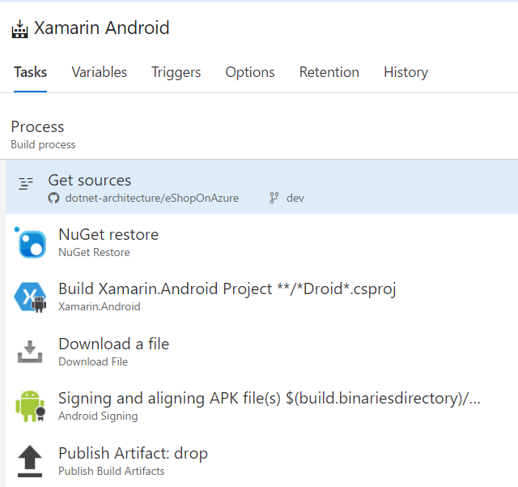
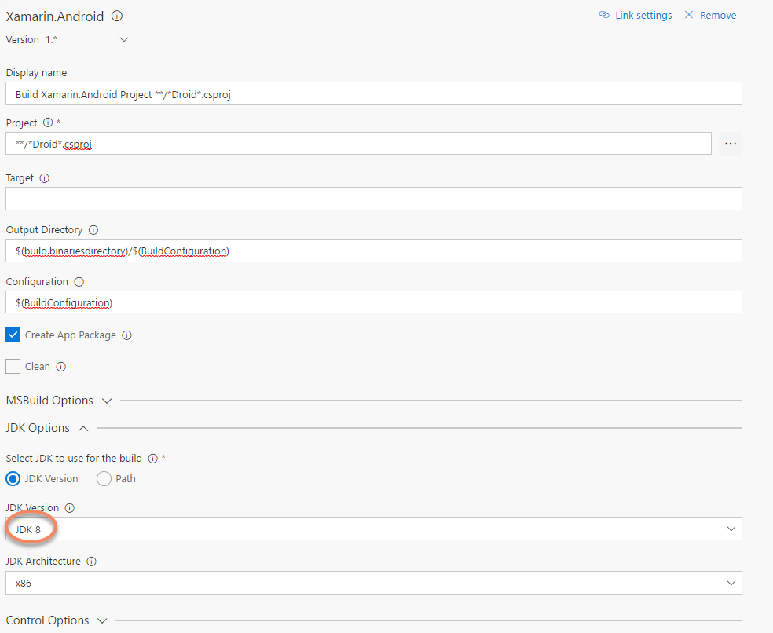
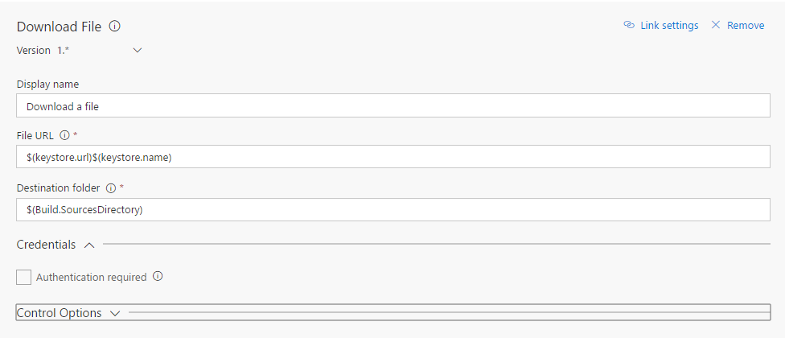
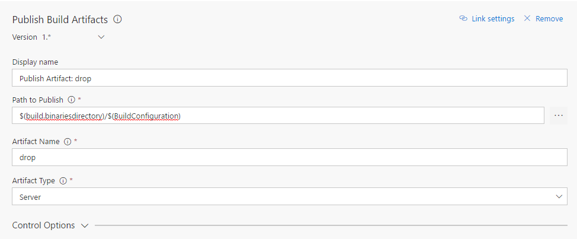

# Xamarin Android Build

Follow these steps to create a VSTS build for your eShopOnContainers app (android).

**Note**: This document assumes basic knowledge about creating builds and configuring external VSTS connections 

## Creating the build

Despite the _"Get Sources"_ task there are five tasks more in the build:

1. Restore NuGet Packages
2. Build Xamarin Android Project
3. Download the certstore to sign the APK
4. Sign the APK
5. Publish the build artifact.

Let's discuss each of them.

### Restore NuGet Packages

Add a "NuGet restore" task and enter the following configuration:

1. Enter `eShopOnContainers-Android.sln` in "Path to solution, packages.config, or project.json". This sln is created ex professo for the build and contains only the Xamarin Android project plus the Xamarin Forms one.

### Build the project

Add a "Xamarin Android" task with following configuration:

1. `**/*Droid*.csproj` in "Project"
2. `$(build.binariesdirectory)/$(BuildConfiguration)` in "Output Directory"
3. `$(BuildConfiguration)` in "Configuration"
4. Ensure that the "Create App Package" checkbox is enabled
5. In "JDK Options" be sure to select "JDK 8" in the "JDK Version" dropdown.

### Download the keystore to sign the build

** Note** This require you have a valid keystore. Refer to [this Xamarin article](https://developer.xamarin.com/guides/android/deployment,_testing,_and_metrics/publishing_an_application/part_2_-_signing_the_android_application_package/) for instructions on how create one, using Visual Studio and Xamarin. Or if you prefer, you can read [how use the Android SDK tools to create a keystore](https://developer.android.com/studio/publish/app-signing.html).

This build assumes the keystore is stored somewhere in internet. Beware on where you store your keystores! Keem them safe and privately. Always consider other possible alternatives on where store the keycert:

1. Store in the source control repository, **assuming it's private**. For public repositories this option is discarded
2. Store in the build agent. If you use a custom VSTS build agent, store the keycert files locally in the agent. This is simple and secure.
3. Store in internet. If this is the case, **protect the resource**. You can be forced to use this option if your repository is public *and* you use the VSTS hosted agent.

Add a task "Download file" (**Note:** this task is installed [through a VSTS extension](https://marketplace.visualstudio.com/items?itemName=automagically.DownloadFile)) with following configuration:

1. `$(keystore.url)$(keystore.name)` in "File URL"
2. `$(Build.SourcesDirectory)` in "Destination Folder"

Fill the "Credentials" section accordly.

**Note:** You can, of course, use any other way to download the file (like a Powershell task).

### Signing the APK

Add a "Android Signing" task with following configuation:

1. `$(build.binariesdirectory)/$(BuildConfiguration)/*.apk` in "APK Files"
2. Ensure the checkbox "Sign the APK" is checked
3. `$(Build.SourcesDirectory)\$(keystore.name)` in "Keystore file". This location has to be where the keystore is. If you downloaded it using a previous task (as our example), use the same value. If keystore is physically in the VSTS agent you can use the filepath.
4. `$(keystore.pwd)` in "Keystore Password"
5. `$(keystore.alias)` in "Keystore Alias"
6. `$(key.pwd)` in "Key password".
7. `-verbose` in "Jarsigner Arguments"
7. Ensure the checkbox "Zipalign" is checked.

### Publishing build artifact

Add a "Publish Build Artifacts" task, with following configuration:

1. `$(build.binariesdirectory)/$(BuildConfiguration)` in "Path to publish"
2. `drop` in "Artifact Name"
3. `Server` in "Artifact Type"

## Variables

You need to setup the following variables:

1. `keystore.pwd` -> Password of the keystore
2. `keystore.alias` -> Alias of the keystore
3. `keystore.url` -> Full URL of the keystore
4. `key.pwd` -> Password of the key

